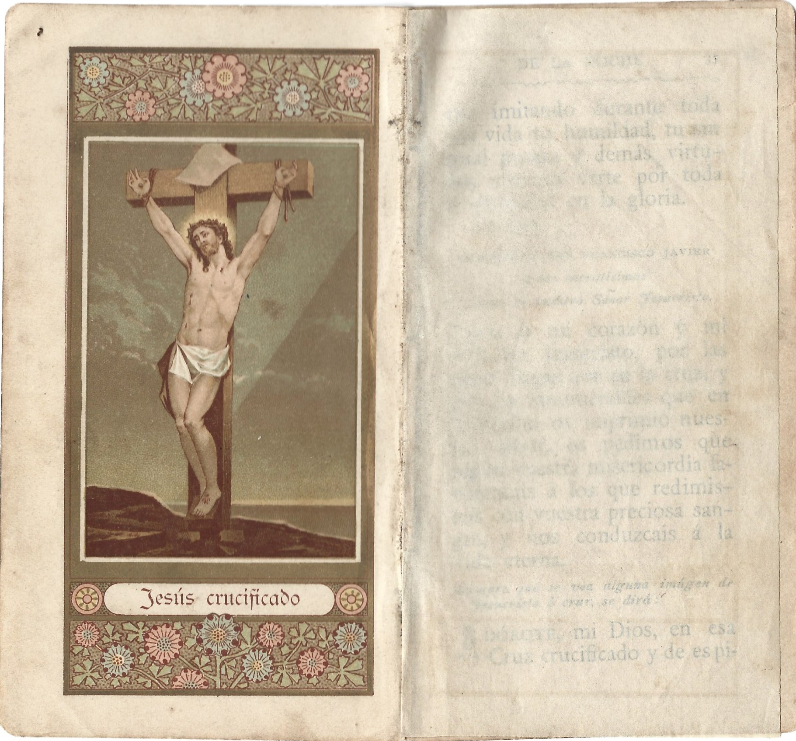

# README

LARGURA: cerca de 8 CENTIMETROS
ALTURA: cerca de 14,8 CENTIMETROS
PROFUNDIDADE: cerca de 1,5 CENTIMETROS

sobre a capa do livro: ele tem uma casca, durinha, que tinha relevos com um desenho de um senhor em meio a mata, segurando uma florzinha na mao, esse senhor estava agachado e suas vestes cobriam quase todo o seu corpo, como que um monge ou frei, pessoa simples do campo.

observa'coes sobre o livro: tinha muitos simbolos de cruz (mais sobre isso adiante), simbolos latinos que nem eram passiveis de ser replicados(as) (pelo menos, nao com o conhecimento deste que vos escreve), simbolos que podem ter no LaTeX, mas tambem podem nao ter (precisamos verificar - e ai? vais querer contribuir??), algumas imagens bem vividas (como jesus na cruz, nitido, claro e cristalino, sem sombra de duvidas, no tamanho da folha!), outras, um tanto mais preto e branco, menores, quase que sem tanta relevancia, no come'co dos capitulos, pareciam fabricas/industrias, como se o monge que escreveu essa baga'ca estivesse falando algo nas linhas de "olha, a gente sofreu trabalhando, mas nao foi nada - se comparado ao quanto sofreu o nosso senhor e salvador Jesus Cristo!!".

Enfim, eh um livro catolico bem trabalhado, muito bonito e bem feito, mas que descascava aos poucos, foi sofrendo os efeitos do tempo e... bem.... eu penei pra caramba, ate mesmo porque to sem acentua'cao (e sem saco) pra arrumar o teclado do jeitinho certo no windows, eh uma briga (pelo menos pra mim eh uma briga, your mileage may vary) alias, um segredinho entre nos?? eu ate passei o dedo pra quebrar um peda'co dessa casquinha... me sinto um vandalo, sei que ja teve gente que foi pra fogueira por menos, mas eh a vida, neh, jovem! errando, quebrando, consertando e aprendendo, ahahahahah.

Sobre o autor (transcritor): quem foi que escreveu esse livro, eu nao sei nao, mas nao fui eu (Eduardo Garcia Bulsoni)!!! eu so copiei o livro que ja estava pronto, estou tentando ser o mais honesto e razoavel possivel, pra que nao aconte'ca nenhum mal entendido, deu uma trabalheira do caramba copiar esse livro todo, converter, mexer com ele e transformar em algo leg'ivel, entao, por favor, nao desmere'ca o autor (ou transcritor, ou co-autor, ou qualquer trabalhador, na verdade), nao gostou?? vai escrever o teu livro! fazer a tua obra! ser o autor da tua propria historia!!#%_!_ enfim, se voce gostou do conteudo aqui apresentado, considere me ajudar financeiramente, voce pode fazer um pix* pra mim!

# PARA OS QUE QUEREM CONTRIBUIR COMIGO (E ATE COM ESSE REPO, ou mesmo fora dele)

## LEMME MAKE THIS CLEAR: THE BOOK NEEDS THOROUGH REVISION, PUNCTUATION, IMAGES, SPACING STYLE, MISSING WORDS, THERE ARE MANY, MANY CORRECTIONS TO BE MADE, AND I HOPE AND VOW THEY'LL BE MADE IN DUE TIME, CAVEAT EMPTOR.

Problemas:
1. tem uma penca de erros gramaticais pelo livro, se tu abrir essa baga'ca num processador de texto (tipo um word da vida), deve dar pra ajudar um montao.

2. Nao sei colocar o sinal da cruz no computador, queria um alt+qualquer_numero pra por a cruz como caractere mesmo. Poderia teclar um windows+. e escolher um emoji de cruz, mas me parece antiquado pra um livro tao antigo cometer tal atrocidade. Isso precisa de busca.

3. Muito provavelmente eu deixei passar um sublinhado, com toda certeza eu fugi de deixar os textos mt pequenininhos, pra nao incomodar o leitor, ate pq o markdown eh meio ingrato quanto a essa parte de propor'cao, enfim, se vc nao gostou do livro, uma pena, sei que poderia ter feito muito melhor no LaTeX, eh so que markdown eh bem mais produtivo, mas reconhe'co que com LaTeX ficaria muito mais profissional... eu to ligado...

4. aos computeiros de plantao: as vezes um regex ou find and replace pode dar uma ajudinha a polir esse trem.

FAQ:

1. Como isso foi feito??
R. Pra nao dizer que foi inteiramente por uma unica pessoa, escrito tudo digitado, linha por linha, pagina por pagina, eu vou apenas conceder que, em alguns momentos, tive que utilizar o ctrl+c e ctrl+v.
inb4: "ah, mas eu duvido"
eu nao preciso te provar nada. Duvida? vai la inspecionar os metadados, eu escrevi isso na mao sim, na era da IA sim.

2. Por que voce transcreveu essa bodega?
R. Medo de deixar minha cultura morrer ficando de bra'cos cruzados.

3. Voce fez um repo com 3 linguagens: Espanol, Ingles e Portugues, por que??
R. Porque eu posso, deal with it! nao gostou?? faz o teu livro, faz o teu repo, forka e muda, escafeda-te.

4. Voce eh cristao?
R. Sim, mas tambem sou meio pagao.

5. Preciso do livro pra corrigir alguma parte, vc pode me mandar foto?
R. Claro, meu confrade, so que eh o seguinte: vai com calma, pq eu sou maquina lenta, haushuashuhausuahsuh, tipo, nao me pede o livro todo de uma vez, me pede algumas paginas especificas em algum dia, eventualmente a gente consegue arrumar tudo.

6. Voce cometeu erros bizarros de espa'camento, formata'c~ao, e ate de digita'c~ao, sabe disso, ne?
R. Sim, perdao por tudo isso, sei que a biblia bem diz que "nem uma virgula, nem um til passarao em vao, ate que chegue o fim/consuma'c~ao dos tempos" ou coisa assim, pois eh, eu sou humano, eu erro, eu tenho problemas como qualquer um, nao sou jesuita, monge, nem nada disso, ao menos nao acho que sou.

7. Tenho outras perguntas! onde te encontrar?
pode me mandar um zap, ou email, ou chama no discord, sei la, velho, eu nem garanto que vou responder, pra ser bem sincero, de uns tempos pra ca eu desativei uma penca de coisas, pq eh chato pra caramba virar refem dum celular.

8. Que dia vc escreveu essa parada toda?
R. Bem, sou um cara ruim de me situar no tempo, mas devo-lhe dizer que, no momento em que escrevo essa bodega aqui que tu ta lendo, estamos no dia 13 de maio de 2026, as 19:49 de la noche, ?perfecto? o no? enfim, escrevi ate mais ou menos a pagina 194, em breve as 220 paginas terao sido totalmente copiadas.

9. Poxa, mas vc botou o teu pix, nao colocou uma licen'ca nesse repo, subiu tudo na branch main, fez tudo meio esculhambado?
R. Eh isso ai mesmo, nao gostou, pode cair fora.
Desculpa a sinceridade, mas eh o que eu tenho pra hoje, eu olho pro git e eu vejo um sistema de armazenamento em nuvem, nao um sistema de controle de versao, pois eh, me falta conhecimento.
alias, que licen'ca que eu ponho num livro que nem fui eu que tirei da cabe'ca?? eu nao sei, velho.

10. Voce quer que eu te contate pra contribuir? posso subir no seu git? podemos conversar? vai ter versoes mais atualizadas desse livro?

R. Vou ser bem curto e grosso... n~ao vou ajudar tanto, mas tambem nao vou fazer a tua cabe'ca: achou que vale a pena, contribui, senao, cai fora.

## CONVEN'COES:

p. 148 em diante => sinal de cruz = (c)

# CONTRIBUI'CAO VOLUNTARIA.

O que, voce nao achou que eu trabalho de gra'ca, ne?? hahahahah, jajajaja, huehuehuehuehuehue, lol.

*o que eh o pix? eh a forma mais simples de fazer um pagamento para um Brasileiro nos dias de hoje!! quaisquer 2 reais ja ajudam bastante, pode acreditar!!!!

Para me transferir R$ 17,99 pela conta do Nubank ou de outros bancos pelo Pix, entre em

https://nubank.com.br/cobrar/e324x/6a038d4f-6130-4ce0-b3d4-1a34ba3c3a09

por que este valor?? bem, vc consegue me ajudar a nao passar aperto na rua (comprar um salgado), fazer uma limpeza bocal melhor nas minhas idas semestrais ao dentista, erguer fundos para ajudar o meu cl~a, meus amigos de batalha (FOR THE HORDE, CARAMBA!!! BORA TOMAR UM BR_AVA-LANCHE, DESGRAMA), me ajudar quando estou perdido na internet todo atarefado com faculdade e o escambal, enfim, vc pode me ajudar - ou pode ignorar, a escolha eh toda sua.

QUERO TRANSFERIR UM VALOR ARBITRARIO => egbulsoni@gmail.com

# livreto_catolico_pt1
# ORACION DE LA MANANA

En el nombre del padre, y del hijo, y del espiritu santo. Asi sea.
Venid, espiritu divino, iluminad mi entendimiento, llenad mi corazon, y encended en el el fuego de vuestro amor.
V. Envianos, Senor, tu Espiritu.
R. Y renovaras la faz de la tierra.

Oracion.

Oh Dios, que te dignaste ilustrar los corazones de tus fieles con la claridad del Espiritu Santo, concedenos el que, animados de este mismo Espiritu, sepamos juzgar y obrar con rectitud, y disfrutemos siempre de sus celestiales consuelos. Amen.
Altisimo Dios y Senor mio, Verdad infalible, en quien creo, Clemencia inefable, en quien espero, Bondad infinita, a quien amo sobre todas las cosas, y a quien me pesa de haber ofendido; os doy gracias por haberme criado, redimido, hecho cristiano y conservado hasta este dia, que me propongo emplear en vuestro santo servicio mediante los auxilios de vuestra gracia.
Ofrezco, pues, a honra y gloria vuestra todos mis pensamientos, palabras, obras y trabajos del presente dia, con intencion de ganar cuantas indulgencias pueda, rogandoos por los fines, que tuvieron los santos Pontifices en concederlas, y aplicandolas en sufragio de las benditas Animas del purgatorio y en satisfaccion de mis pecados.
No permitais, Padre mio amorosisimo, que os ofenda en este dia, libradme de los lazos que me tienda el enemigo, y dadme fortaleza para huir de las ocasiones de pecar y vencer mi pasion dominante. Quiero vivir y morir en vuestra santa Fe, para que sirviendoos en esta vida, merezca gozaros en el reino eterno de la gloria. Amen.

Alcanzadme este favor, Angeles y santos del cielo, y Vos en especial, san N.., patron y abogado mio, interceded por mi.

# ORACION DOMINICAL

Padre nuestro, que estas en los cielos; santificado sea el tu nombre; venga a nos el tu reino; hagase tu voluntad asi en la tierra como en el cielo. El pan nuestro de cada dia danosle hoy, y perdonanos nuestras deudas, asi como nosotros perdonamos a nuestros deudores, y no nos dejes caer en la tentacion. Mas libranos de mal. Amen.

# SALUTACION ANGELICA

Dios te salve, Maria; llena eres de gracia; el Senor es contigo, bendita tu eres entre todas las mujeres, y bendito es el fruto de tu vientre, Jesus.
Santa Maria Madre de Dios, ruega por nosotros pecadores, ahora y en la hora de nuestra muerte. Amen.

# EL CREDO.

Creo en Dios Padre Todo-poderoso, Criador del cielo y de la tierra; y en Jesu-Cristo su unico Hijo, nuestro Senor, que fue concebido por el Espiritu Santo, y nacio de Santa Maria Virgen: padecio debajo del poder de Poncio Pilato; fue crucificado, muerto y sepultado; descendio a los infiernos; al tercero dia resucito de entre los muertos; subio a los cielos, y esta sentado a la diestra de Dios Padre Todopoderoso; y desde alli ha de venir a juzgar a los vivos y a los muertos. Creo en el Espiritu Santo, la santa Iglesia Catolica, la comunion de los Santos, el perdon de los pecados, la resurreccion de la carne, y la vida perdurable. Amen.

# LA SALVE

Dios te salve, Reina y Madre de misericordia, vida, dulzura y esperanca nuestra: Dios te salve; a ti llamamos los desterrados hijos de Eva; a ti suspiramos, gimiendo y llorando en este valle de lagrimas. Ea pues, Senora abogada nuestra, vuelve a nosotros esos tus ojos misericordiosos; y despues de este destierro, muestranos a Jesus, fruto bendito de tu vientre.
!Oh clementisima! !oh piadosa! !oh dulce siempre Virgen Maria! ruega por nos, santa Madre de Dios, para que seamos dignos de alcanzar las promesas de nuestro Senor Jesucristo. Amen.

# ACTO DE FE.

Dios mio, creo firmemente y con toda mi alma y corazon, todo lo que la santa Iglesia catolica, apostolica y romana, me manda creer porque Vos sois, oh Verdad infalible, quien se lo ha revelado.

# ACTO DE ESPERANZA.

Dios mio, espero con entera confianza, que por los meritos de Jesucristo, mi Redentor, me concedereis vuestra gracia en esta vida y la gloria en la otra, si observo vuestros santos mandamientos, porque Vos me lo habeis prometido y nunca faltais a vuestras promesas.

# ACTO DE CARIDAD.

Os amo, Dios mio, con toda mi alma, os amo sobre todas las cosas, porque Vos sois infinitamente amable, y amo a mi projimo como a mi mismo por vuestro amor.

# ORACION A LA VIRGEN COMPUESTA POR S. BERNARDO.

Acordaos, oh piadosisima Virgen Maria, que jamas se ha oido decir, que ninguno de cuantos se han acogido bajo vuestro amparo, han implorado vuestro socorro y dirigidoos sus suplicas, haya sido abandonado. Animado yo con tal esperanza, corro hacia Vos, Virgen madre de las virgenes: vengo a Vos y me postro a vuestros pies, sollozando y pediendo. No desatendais mis ruegos, oh Madre del Verbo: oidme, si, y escuchadme propicia. Asi sea.

Bendita sea tu pureza
Y eternamente lo sea,
Pues todo un Dios se recrea
En tan graciosa belleza.
A ti celestial Princesa
Sagrada Virgen Maria
Te ofrezco desde este dia
Alma, vida y corazon,
Mirame con compasion,
No me dejes, Madre mia.

# EL ANGELUS.

El Angel del Senor anuncio a Maria, y concibio por obra del Espiritu Santo.
Dios te salve, Maria, etc. He aqui la esclava del Senor; hagase en mi segun tu palabra.
Dios te salve, Maria, etc. Y el Verbo se encarno y habito entre nosotros.
Dios te salve, Maria, etc.
V. Ruega por nosotros, santa Madre de Dios.
R. Para que seamos dignos de alcanzar las promesas de nuestro Senor Jesucristo.

# ORACION

Os suplicamos, Senor, derrameis vuestra gracia en nuestras almas afin de que, habiendo conocido por la anunciacion del Angel el misterio de la encarnacion de vuestro Hijo Jesucristo, por los meritos de su pasion y cruz, seamos conducidos a la gloria de su Resurreccion. Os lo pedimos por el mismo Jesucristo nuestro Senor. Asi sea.

En el tiempo Pascual se puede decir en su lugar:

Alegrate, Reina del cielo, aleluya.
Porque el que en tu seno llevar mereciste, aleluya.
Resucito como dijo, aleluya.

Ruega a Dios por nosotros, aleluya.
V. Gozate y alegrate, Virgen Maria, aleluya.
R. Porque verdaderamente ha resucitado el Senor, aleluya.

# ORACION

Oh Dios, que por la resurreccion de vuestro Hijo, nuestro Senor Jesucristo, os dignaste comunicar la alegria a todo el mundo: os suplicamos nos concedais el que por la intercesion de su madre, la Virgen Maria, participemos de los gozos de la vida eterna. Por el mismo Jesucristo nuestro Senor. Asi sea.

# AL ANGEL CUSTODIO.

Angel de Dios, bajo cuya custodia me puso el Senor con amorosa piedad, a mi que soy vuestro encomendado, alumbradme hoy, guardadme, regidme y gobernadme. Amen.

# ORACION

# AL SANTO DE CADA UNO.

A vos san N., que me honro con llevar vuestro nombre, os ruego que os digneis protejerme e infundirme un vivisimo deseo de adquirir vuestras virtudes, para que sirviendo como vos en la tierra a mi Criador, goce tambien despues como Vos de las inefables dulzuras del paraiso.
R. Amen.

# ORACION A TODOS LOS SANTOS.

Siervos de Dios, que por haber resistido las tentaciones del maligno espiritu y observado exactamente la ley santa, gozais de las eternas delicias de la gloria, dignaos interceder con nuestro misericordiosisimo Salvador para que no me llame improvisadamente a su tremendo tribunal sin haber yo recibido antes con ferviente contricion los saludables Sacramentos.
R. Amen

---

# BENDICION DE LA MESA PARA SEGLARES

Haciendo la senal de la cruz sobre la comida, se dice:

Bendecidnos, Senor, y a estos dones que vamos a recibir de vuestra mano. Por nuestro Senor Jesucristo.
R. Amen

# ACCION DE GRACIAS.

Todas vuestras obras os confiesen, Senor, y vuestros santos os bendigan. Gloria Patri, etc.

# ORACION DE LA MANANA

# ORACION

Gracias os damos, Senor Dios omnipotente, por todos vuestros beneficios. A vos, que vivis y reinais por todos los siglos de los siglos. Asi sea. En el nombre del Padre y del Hijo y del Espiritu Santo. Asi sea.

# ORACION DE LA NOCHE

EN EL NOMBRE DEL PADRE, Y DEL HIJO, Y DEL ESPIRITU SANTO. ASI SEA.

Dios mio, bendecidme por vuestra bondad, y concededme una noche quieta por la intercesion de la Virgen Santisima. Amen.

Senor mio Jesucristo, concededme la gracia de que en toda mi vida y especialmente en la hora de mi muerte, me acuerde de vuestros beneficios, y jamas olvide que no hay cosa mas fea ni perniciosa que el pecado, ni cosa mas bella y preciosa que la virtud;
que los transgresores de vuestra ley seran castigados con penas eternas en el infierno, y los que fielmente la observaren, disfrutaran despues de la muerte de una vida bienaventurada en el cielo.

Confieso, Dios mio, que he pecado mil veces con el deseo, con la palabra y con las obras; por lo tanto yo me humillo profundamente delante de Vos y os suplico rendidamente me otorgueis el perdon de mis culpas. Yo detesto, Senor, de todo corazon el pecado, y protesto de no consentir mas en el, y si alguna vez vencido por la tentacion pecare, suplico a Vuestra Majestad me favorezca con su gracia, para que confesandolo debidamente, viva y muera en vuestra amistad.
Os doy gracias, Dios mio, por tantos beneficios, recebidos hasta el presente de vuestra benefica mano.

Cuantas mercedes he recibido hoy mismo de vuestra infinita bondad. Pero cuantas veces he abusado de ellas.
Tened compasion de mi, dadme a conocer todas mis faltas, y concededme un verdadero dolor de haberlas cometido.

Aqui se hara el examen sobre los pecados cometidos y en especial acerca de lo que se ha faltado en aquel dia.
Digase luego la Confesion y un acto de contricion. Padre nuestro, etc. como por la manana

# EL SUB TUUM PRAESIDIUM.

Bajo tu amparo nos acogemos, santa Madre de Dios, nos desoigas los ruegos, que te dirigimos en nuestras necesidades, antes bien libranos de todo peligro, oh Virgen gloriosa y bendita.

V. Dignate, Virgen sagrada, que yo te alabe.
R. Dame fuerzas contra tus enemigos.

Dad, oh Dios mio, el descanso necesario a mi cuerpo.
Os suplico me bendigais desde el cielo, y me guardeis esta noche de todo mal: y os pido que si mi conciencia se halla cargada de algun pecado del que tenga olvido involuntario, me deis gracia para conocerlo.
Haced que mi corazon no se aparte nunca de Vos; velad Vos mismo por mi; sed mi luz en medio de las tinieblas; disipad los suenos y pensamientos malos durante esta noche, permaneced en mi, para que descansando en Vos y despertando para Vos, os preste mis adoraciones aun con mi descanso.

Virgen Santa, madre de Dios, rogad por mi: Angeles todos, velad por mi: Santos y Santas del Senor, y vos N. (se nombra el Santo Patron) principalmente con cuyo nombre me honro, rogad todos por mi.

Criador y Redentor de todos los hombres, conceded a las almas de los difuntos la entera remision de sus pecados que con tanto ardor estan deseando; os pido esta gracia, oh divino Salvador que vivis y reinais por los siglos de los siglos. Asi sea.

En el nombre del Padre, etc.

# ORACION

Por los vivos y por los fieles Difuntos.

Derramad, Senor, vuestras bendiciones sobre mis padres, parientes, bienhechores, amigos y enemigos. Protejed a todos mis superiores, asi espirituales como temporales.
Socorred a los pobres, a los encarcelados, a los afligidos, a los viajeros, a los enfermos y a los agonizantes. Convertid a los herejes y pecadores; e iluminad a los infieles.

  Oh Dios de inmensa misericordia, compadeceos tambien de las almas de los fieles que gimen en el purgatorio: poned termino a sus tormentos, llamandolas al descanso y a la luz de que gozan los espiritus bienaventurados. Asi sea.

# ORACION A MARIA SANTISIMA.

Oh Virgen Maria, Madre de Dios! confiado en vuestra proteccion y misericordia os encomiendo hoy, y cada dia, y en la hora de mi muerte mi alma y cuerpo, y pongo en vuestras manos toda mi esperanza y todo mi consuelo hasta el fin de mi vida; para que por vuestra intercesion y merecimientos, se dispongan y encaminen todas mis cosas y obras a vuestra voluntad; y os suplico que, por el afecto y devocion que os profeso, me liberteis de todos los peligros en que pueden caer mi alma y cuerpo, para que, permaneciendo en la gracia de vuestro santisimo Hijo, consiga la gloria que por vuestros meritos gozais con El en el cielo. Asi sea.

# ORACION AL PATRIARCA SAN JOSE.

Gloriosisimo patriarca Jose, fidelisimo esposo de Maria y padre putativo de Jesus, en union del amor con que el eterno Padre encomendo su amado Hijo Jesucristo y la sacratisima Virgen Maria su Madre a vuestra prudencia, yo me entrego a vos desde hoy por todos los dias de mi vida y singularmente encomiendo mi alma y cuerpo a vuestra singular custodia en el trance de la muerte. A vos, piisimo Jose, elijo por mi primer patron despues de Maria santisima: en vos pongo mi consuelo y esperanza, para que todas mis cosas se dirijan por vuestros meritos, todas mis obras se dispongan conforme a la voluntad de vuestra amantisima esposa Maria, Madre de Jesus, Senor nuestro; y os suplico me recibais por vuestro perpetuo siervo, para que siempre os sirva y logre con vuestra intercesion la gracia de Jesus y la proteccion de Maria con quienes disfrutais de la eterna gloria.
Asi sea.

# ORACION AL SANTO ANGEL DE LA GUARDA.

ANGEL santo, mi guia y custodio, a quien tantas veces he contristado con mis pecados, guardadme, yo os lo ruego, no me abandoneis en medio de los peligros; no me dejeis expuesto sin defensa a los tiros de un enemigo tan astuto como cruel, que de todos los medios se vale para perderme; no me dejeis ni un solo instante: antes bien vuestras amables inspiraciones dirijan y fortifiquen mi alma y reanimen mi corazon desfallecido. Comunicadle, Angel santo, alguna chispa de aquel amoroso fuego que os abrasa a fin de que cuando llegue el termino de

esta miserable vida, pueda en vuestra compania y la de todos los angeles. alcanzar la vida eterna; y ver sin cesar a Jesus, mi Redentor, y alabarle y bendecirle eternamente.
Asi sea.

# ORACION

AL ARCANGEL SAN MIGUEL.

Oh glorioso san Miguel, principe de la angelica milicia, guarda de la Iglesia y defensor de las almas; humildemente os ruego que me amparen vuestras suplicas, me defienda vuestra fortaleza, que me esfuerce y anime vuestra virtud, para que al acabar esta mortal vida, y defendido por vos del infernal dragon, sea por vuestras manos presentado limpio de toda culpa delante de la divina Majestad. Amen.

# ORACION

A SAN ANTONIO DE PADUA.

Santo glorioso, vos que tuvisteis la dicha de ver en vuestros brazos al Redentor Jesus transfigurado en nino, por aquella delicia indecible que gozasteis, os ruego que me inspireis una constante aversion a los terrenos placeres y un amor grande a las cosas celestiales, me defendais en todos los peligros, me socorrais en las necesidades de este valle de lagrimas, y de tal modo aviveis mi celo por la gloria de Dios, que pueda imitar las eminentes virtudes que os hicieron digno de la eterna bienaventuranza.
Asi sea.

# ORACION A SANTA CECILIA.
Gloriosa virgen y martir Cecilia; que con los ardores del casto amor divino, imitasteis en la tierra a los serafines mas inflamados del cielo; Vos que como la esposa de los cantares ibais siempre en busca de vuestro esposo que no era otro que Jesus Hijo de Dios; Vos que para conservar puro e inocente vuestro corazon persuadisteis a vuestro esposo guardara castidad, mereciendo a entrambos la renuncia de los deleites carnales, la posesion de la eterna bienaventuranza; pedid al Senor que inflame mi corazon con el fuego del divino amor, para que consumiendo mi amor propio y todo otro amor que no sea Dios, me mueva a amar sobre todas las cosas y con todas las fuerzas de mi alma a la bondad infinita, a cumplir en todo su ley santisima, a consagrarme enteramente a su servicio, para tener en todo esto una segura prenda de la herencia de la gloria, prometida por Dios a los que le aman.
Asi sea.

# ORACION A SANTA LUCIA.

Martir del Senor, santa Lucia, por aquella fe tan grande que tuvisteis, derramando vuestra sangre y ofreciendo vuestra vida en testimonio de ella, en medio de las llamas, que circuian vuestro cuerpo; alcanzadme del Senor, el que permanezcamos siempre firmes en la fe, y que nuestras obras esten siempre en armonia con nuestras creencias; como tambien que el Senor nos libre por vuestra intercesion de incendios en las casas y de movimientos de ira en nuestros cuerpos y nos conserve el sentido de la vista. Amen.

# ORACION AL MISTERIO DE LA PURISIMA CONCEPCION DE NUESTRA SENORA.

patrona de las Espanas, que rezaba todos los dias el papa Sixto IV.

ALABADA seas, oh Santisima Virgen Maria Madre de Dios, reina de los cielos, Puerta del paraiso y Senora de todo el mundo. Tu eres sola concebida sin pecado original; tu eres aquella Virgen pura que concibio a Jesucristo sin mancha por obra del Espiritu Santo: tu la Virgen Madre de los pecadores. Te suplico, Senora, que ruegues por mi a Jesucristo, tu querido Hijo y Senor nuestro, y me libres de todos los males temporales y espirituales, a fin de que imitando durante toda esta vida tu humildad, tu sin igual pureza y demas virtudes, merezca verte por toda la eternidad en la gloria. Asi sea.

# ORACION DE SAN FRANCISCO JAVIER
a las sacratisimas Llagas de nuestro Senor Jesucristo.

Dios de mi corazon y mi Senor Jesucristo, por las cinco llagas que en la cruz, y por las innumerables que en la Pasion os imprimio nuestro amor, os pedimos que segun vuestra misericordia favorezcais a los que redimisteis con vuestra preciosa sangre, y nos conduzcais a la vida eterna.

Siempre que se vea alguna imagen de Jesucristo o cruz, se dira:

Adorote, mi Dios, en esa Cruz crucificado y de espinas coronado; ruegote, Senor mio Jesucristo, por la lanzada de tu Santisimo costado, mi buen Jesus de mi alma y de mi vida, Salvador del mundo, que no me dejes morir en pecado.

Siempre que se vea alguna imagen de la Virgen Santisima, se dira:

Dios te salve, Hija de Dios Padre: Dios te salve, Madre de Dios Hijo: Dios te salve, Esposa del Espiritu Santo: Dios te salve, Maria Santisima, concebida sin mancha de pecado original.

# ORACIONES PARA LA CONFESION

ORACION
para pedir gracia para llegar a confesarse con las disposiciones necesarias.

Santisimo Dios, que estais siempre dispuesto favorablemente para recibir al pecador y perdonarle, poned vuestra vista en una alma que vuelve a Vos de buena fe, y que busca con que lavar sus manchas en las aguas saludables de la Penitencia. Alumbrad mi espiritu, a fin de que conozca yo todos mis pecados: encended mi corazon para que yo los deteste, mediante lo cual obtenga el perdon de ellos.

Invocad el socorro del Espiritu Santo para conocer vuestras culpas.

Espiritu Santo, dignaos enviar uno de vuestros rayos a mi corazon, y venid a ayudarme a conocer mis pecados.
Hacedme conocer !oh Dios! tanto lo malo que he cometido, como lo bueno que he omitido. Haced que yo sepa hasta que punto he ofendido a mi projimo, y las faltas que he cometido contra las obligaciones de mi estado.

Casos en los cuales es preciso nacer confesion general.

1. Cuando no se hizo antes el debido examen.
2. Si no confeso todos sus pecados, segun se acordaba, en materia grave.
3. Cuando en la primera o mas crecida edad tuvo algun tocamiento deshonesto, deseo, o palabras provocativas para ello, en su persona, o en otras. Si se dejo algo en la confesion por verguenza, miedo duda o malicia, de industria o en otra materia grave.
4. Si no tuvo dolor, ni proposito de la enmienda, ni de satisfacer al projimo.
5. Cuando dijo mentira de pecado mortal en la confesion.
6. Cuando busco confesor tal que no le hubiera de entender.
7. Cuando estando con alguna censura, no la declaro a sabiendas, o si de industria se hizo absolver de quien no tenia potestad, y ciencia para ello.

Para que nadie se embarace en el modo de hacer la confesion general, si quiere por escrito o de memoria, discurra por el orden que a seguida marcamos, desde que tuvo uso de razon hasta que comulgo, y de alli hasta que tomo estado, y despues hasta de presente, que conversaciones tuvo, que costumbres, que tratos y que vicios, reduciendo el numero de los pecados de cada especie, lo cierto como cierto, y lo dudoso como dudoso, y si no sabe el numero, diga la costumbre poco mas o menos, o el tiempo, si de otro modo no se puede acordar.
Y supuesto este examen diga lo que le remuerde y entiende en su conciencia, y aquietese, confiando en que nuestro Senor le perdonara sus pecados, pues ha hecho lo que ha podido.

# EXAMEN DE CONCIENCIA

PRIMER MANDAMIENTO.

Ver si en las confesiones pasadas ha callado advertidamente algun pecado, o si en las penitencias o comuniones ha habido alguna falta.
Acusarse si ha sido causa, o inducido a otros a pecar.
Si se ha alabado de los pecados, asi suyos como de otros.
Si no creyo; si se puso a dudar de proposito de alguna cosa de fe, cuantas veces.
Si ha dado credito a suenos, aguero, o a rayas de manos.
Si ha tenido queja o impaciencia contra Dios, juzgandole en los trabajos
Si ha desconfiado de su salvacion, si ha dilatado la enmienda para la vejez.
Si ha dicho blasfemias contra Dios y sus Santos.
Si ha consultado a hechiceros, adivinos o gitanas.
Si no sabe lo necesario para salvarse, como el Misterio de la Santisima Trinidad, el de la Encarnacion de nuestro Senor Jesucristo, el Credo (entendiendole), el Padre nuestro, los Mandamientos y los Sacramentos.
Si lleva nominas y oraciones supersticiosas, con las cuales cree que sabra la hora de su muerte, o que no morira sin confesion, etc.
Si ha leido, o tiene libros prohibidos.
Si ha curado o hecho curar a si, o a otros con palabras vanas y acciones supersticiosas.

SEGUNDO MANDAMIENTO.

Si interiormente se resolvio a jurar o atestiguar falso.
Si ha jurado con mentira o con duda, cuantas veces.
Si tiene costumbre de jurar sin advertirlo, diga las veces y los dias.
Si ha jurado amenazando vengarse.
Si prometio con juramento de no hacer bien o de hacer mal.
Si ha dejado de cumplir lo que ha votado, jurado o prometido, siendo cosa buena.

TERCER MANDAMIENTO.

Si ha determinado de no guardar las fiestas, y de trabajar, o hacer trabajar en ellas.
Si tuvo intencion de no oir Misa, de no ayunar, ni confesar, ni comulgar a su tiempo.
Si oyendo Misa ha hablado toda ella, o parte notable con otros, y si les ha inquietado.
Si no ha rezado lo que tiene obligacion.
Si no oyo Misa entera en dias de precepto por su culpa.
Si la oyo con poca reverencia; haciendo senas u otras cosas indecentes.
Si estorbo a sus criados que la oyesen.
Si trabajo o hizo trabajar en dia de fiesta, cuantas horas.
Si no ha ayunado los dias de su obligacion.
Si ha comido cosas prohibidas sin tener bula.
Si ha recibido algun sacramento en pecado mortal, excomungado, o con otra censura.

CUARTO MANDAMIENTO.

Si ha consentido interiormente de no honrar o socorrer a sus padres o superiores.
Si ha perdido el respeto o despreciado a padres, marido, o mayores.
Si no ha corregido el pecado, o permitindole, debiendo impedirlo.
Si ha maldecido a sus padres.
Si se ha mofado de Sacerdotes o Religiosos, o viejos, o pobres.
Si ha maltratado o herido a su mujer, o a sus mayores.
Si da mal ejemplo a su familia, y no cria a sus hijos con buenas costumbres.
Si a sus padres no los socorrio en sus necesidades, pudiendo.
Si a su mujer o hijos no les da lo necesario.
Si no ha cumplido el testamento de sus padres, o algunas mandas y deudas, etc.

QUINTO MANDAMIENTO.

Si ha deseado la muerte o grave mal a alguno.
Si se ha holgado del mal, o pesadole del bien ajeno.
Si ha tenido odio al projimo, o deseado vengarse de el; cuanto duro el rencor.
Si ha dicho palabras injuriosas.
Si ha echado maldiciones de corazon, si tiene de ello costumbre, cuantas al dia o semana.
Si niega el habla a alguno.
Si ha hecho o mandado hacer algun mal a su projimo.
Si ha aconsejado rencillas o chismes, poniendo en mal a otros.

Si ha muerto, herido, o dado golpes a su projimo.
Si ha dado armas para danar a alguno.
Si se ha excedido en el castigo de los suyos.
Si no quiere perdonar al que lo injurio.
Si ha procurado aborto antes o despues de animada la criatura.
Si ha comido o bebido demasiado, y de modo que le haya hecho dano.

SEXTO MANDAMIENTO.

Si ha tenido pensamientos torpes, y a sabiendas, deteniendose o complaciendose en ellos, o si ha deseado la ejecucion, cuantas veces, y con que estado de personas, sin nombrarlas.
Si ha tenido aficion peligrosa o deshonesta
Si ha dicho palabras torpes, si ha cantado u oido cantar canciones deshonestas, si ha leido libros lascivos.
Si ha pecado con soltera, casada, parienta, o con personas que tienen voto de castidad, y si lo tiene el, y si en lugar sagrado.
Si ha tenido tactos deshonestos consigo a solas, o con tercero; y si ha ensenado modos de pecar.
Si esta amancebado o encenagado en este vicio.
Si ha mirado deshonestamente, paseado, hecho senas, enviado presentes y billetes.
Si ha usado de tercero, o si lo ha sido, o encubridor.
Si tiene pinturas o figuras deshonestas.
Si se ha puesto en peligro, yendo con malas companias, o si no quita las ocasiones.
Si siendo casado, ha usado mal del matrimonio con peligro, etc.
Si se ha deleitado de algun mal sueno despues de el.
Si ha usado de malos trajes u otras cosas con mal fin.

SEPTIMO MANDAMIENTO.

Si ha tenido deseo de tomar o tener lo ajeno, o de hacer algun trato, a fin de enganar al projimo.
Si ha consentido en hacer, o que otro haga dano en la hacienda de su amo.
Si ha mandado o aconsejado hacer dano en la hacienda ajena.
Si con juramento engano, o con pleitos injustos ha procurado lo ajeno, o ayudado a que otro se lo procurase.

# livreto_catolico_pt2

Si ha hurtado, cuando y cuantas veces, y si es cosa sagrada.
Si ha dilatado restituir pudiendo, y cuantas veces.
Si ha comprado mas barato, o vendido mas caro de lo justo.
Si hace cambios ilicitos, prestando por interes, cometiendo usura.
Si acompano, participo, encubrio o compro lo hurtado.
Si llevo mas de lo que debia.
Si ha jugado con trampas o con aquellos que no son senores de lo que juegan.
Si no paga lo que debe, o difiere la paga, en especial de jornaleros, criados y artesanos.
Si no hizo las diligencias debidas para restituir lo hallado, o se quedo con ello.

OCTAVO MANDAMIENTO.

Si ha deseado la deshonra o infamia del projimo.
Si ha consentido en deshonrarle cuando pudiese.
Si interiormente se ha resuelto a murmurar o mentir en dano grave.
Si ha juzgado mal de alguno temerariamente, o descubierto su sospecha.
Si ha murmurado del projimo, o gustado de oir murmurar, o no lo ha impedido, pudiendo y debiendo.
Si ha levantado algun testimonio, o mentido en cosas de importancia, o con dano ajeno.
Si ha manifestado el pecado secreto sin necesidad.
Si con su mala lengua ha hecho perder casamiento, dignidad, etc.
Si ha hecho libelos infamatorios y pasquines.
Si ha hecho algo con que desacreditar al projimo.

El nono Mandamiento se reduce al sexto: el decimo al septimo.

Acusese tambien si tiene algun otro pecado acerca de su oficio o estado. Acusese de los propositos malos y deseos, aunque no los haya puesto por obra.
Los pecados capitales se reducen a los mandamientos. La soberbia al 4.o, la avaricia al 7.o, la lujuria y la gula al 6.o, la ira y la envidia al 5.o, la pereza al I.o: y asi no hay que acusarse por ellos. Lo mismo se entiende en los pecados contra las obras de misericordia.

# ORACION

PARA ANTES DE LA CONFESION

!Que motivo de confusion es para mi, oh mi Dios, el caer siempre en las mismas faltas tan repetidamente, tan facilmente, y despues de haberos tantas veces prometido no cometerlas mas! !Que yo haya podido pecar en vuestra presencia por cosas tan leves, conociendo cuanto os desagrada el pecado, y aun abusando de vuestros beneficios para ofenderos! !Oh mi Dios, mi Padre, el mejor y mas paciente de todos los padres! mitigad vuestro enojo, perdonadme, y no me castigueis segun el rigor de vuestra justicia.
Dejaos rogar !oh mi Dios! por el arrepentimiento de un corazon verdaderamente contrito, de un corazon mas pesaroso de sus faltas por el disgusto que habeis recibido, que por la pena que ellas merecen. Dejaos rogar por el arrepentimiento de un corazon sinceramente afligido de haberos desagradado: Vos, que sois infinitamente bueno, y tan digno de ser infinitamente amado.

# ORACION

PARA DESPUES DE LA CONFESION.

Amantisimo Jesus, Dios y Redentor mio, yo os suplico por vuestra bondad infinita que me perdoneis los defectos con que hubiere recibido este santo Sacramento de la penitencia. Dadme gracia, Senor, para la enmienda: dadme en los buenos propositos perseverancia, en los deseos pureza, en las obras inocencia, en las virtudes favor: dadme gracia y espiritu para que en todo haga vuestra santa voluntad.

# ORACION

a la santisima Virgen y al Angel de la guarda

Virgen santisima, Madre de misericordia y refugio del pobre pecador, interceded por mi en este solemne momento, para que la confesion que voy a hacer de mis culpas, no anada una mas a las muchas que ya tengo cometidas, sino que halle en la misma el perdon de lo pasado, y las gracias necesarias para no pecar ya mas en lo venidero.
Santo Angel, celoso y fiel custodio de mi alma, testigo de mis vergonzosas caidas, ayudame con tu divina fortaleza a levantarme; y alcanzame que en este Sacramento que voy a recibir, adquiera la gracia de no caer ya mas en mis pesadas culpas. Amen.

# ORACIONES PARA LA COMUNION

ANTES DE LA COMUNION

ACTO DE FE.

Dios del cielo y de la tierra, Salvador de los hombres !que Vos vengais a mi y que tenga yo la felicidad de recibiros! ?Quien pudiera creer prodigio semejante, si Vos mismo no lo hubierais dicho? Si, Senor, yo creo que Vos mismo sois a quien voy a recibir en este Sacramento: Vos mismo sois, quien habiendo nacido en un pesebre, quisisteis morir por mi en la cruz; y que tan glorioso como estais en el cielo estais oculto bajo los accidentes del pan y del vino.
Yo lo creo, mi Dios, y estoy tan seguro como si lo viese con mis propios ojos. Creolo porque lo habeis dicho, y yo adoro vuestra santa palabra. Yo lo creo, y a pesar de lo que mis sentidos y mi razon pueden decirme, renuncio a mis sentidos y a mi razon para cautivarme bajo a la obediencia de la fe.

Yo lo creo, y si fuese necesario sufrir mil muertes por la confesion de esta verdad, ayudado de vuestra gracia !oh mi Dios! las sufriria, antes desmentir sobre este punto mi creencia y mi religion.

ACTO DE HUMILDAD

? Quien soy yo? !oh Dios de gloria y de majestad! ?quien soy yo para que os digneis poner en mi los ojos? ?De donde me viene este exceso de felicidad, que mi Senor y mi Dios quiera venir a mi? ?A mi pecador, gusano de la tierra, mas despreciable que la misma nada, acercarse un Dios tan santo? ?Comer yo el pan de los Angeles? ?Alimentarme con una carne divina? !Ah, Senor! yo no lo merezco; yo no sere nunca digno de tanto honor.

Rey del cielo, Autor y Conservador del mundo, Monarca universal, nada soy delante de Vos, y quisiera humillarme profundamente por vuestra gloria, como Vos os humillais en este Sacramento por mi amor. Yo confieso con toda la humildad posible, asi vuestra soberana grandeza, como mi extremada bajeza.
La consideracion de la una y de la otra me arroja en una confusion que no puedo explicar !oh mi Dios! Solamente dire con una humilde sinceridad que soy indigno de la merced que os dignais hacerme hoy.

ACTO DE CONTRICION.

Vos venis a mi !oh Dios de bondad y misericordia! !Ah! mis pecados deberian mas bien alejaros de mi! Pero yo los aborrezco en vuestra presencia !oh Dios mio! Sentido por el disgusto que os han causado, tocado de vuestra infinita bondad y resuelto sinceramente a no cometerlos mas, los detesto con todo mi corazon, y os pido humildemente perdon. Perdonadmelos, Padre mio, mi amable Padre, pues me amais hasta permitir que me acerque hoy a Vos.

Yo estoy ya lavado, como creo, por el Sacramento de la penitencia: lavadme aun mas, Senor; purificadme de las menores manchas: criad en mi un nuevo corazon, y renovad hasta el fondo de mis entranas el espiritu de inocencia, de modo que me ponga en estado de recibiros dignamente.

ORACIONES

PARA DESPUES DE LA COMUNION.

Alma de Cristo Santisima, santificarme.
Cuerpo Santisimo de mi Senor Jesucristo, salvame.

Sangre de Cristo purisima, embriagame.
Agua del costado de Cristo purisima, limpiame.
Sudor virtuosisimo de Cristo, saname.
Pasion piisima de Cristo, confortame.
!Oh buen Jesus! guardame.
Entre tus llagas escondeme.
No permitas que yo me aparte de ti.
Del enemigo defiendeme.
En la hora de la muerte llamame.
Mandame venir a ti.
Y colocame junto a ti, para que con los Angeles y Arcangeles, y todos tus Santos, te alabe por todos los Siglos de los siglos. Amen.

ACTO DE AGRADECIMIENTO.

? Como podre agradeceros, Senor, ademas del los beneficios de la creacion, redencion y conservacion, este especialisimo que ahora me haceis, queriendo uniros con la mas vil criatura? Os doy, Senor, gracias por tanta merced; y si he sido un infiel, un vil, un prevaricador, no sere, Jesus mio, un ingrato.
Me acordare siempre que hoy os habeis dado a mi, y procurare que cada momento de mi vida sea un tributo de mi gratitud.

ACTO DE PETICION.

Ahora, Senor, que estais dentro de mi, me postro a vuestros pies, confiado en que nada me negareis. En primer lugar os pido vuestra gracia, que es el mayor bien, y el don de perseverancia para no perderla jamas, dandome despues todos los demas que Vos sabeis necesito. Os pido por la paz de vuestra Iglesia, extirpacion de las herejias, conversion de los infieles y pecadores, alivio de las almas que satisfacen a vuestra justicia en el purgatorio, y en particular la de N. o las de N. N. y N. (aqui se nombra la persona, o personas por quienes se ofrece especialmente la Comunion, si no es cumplimiento de Iglesia; pues en este caso no se debe ofrece especialmente la Comunion, si no es cumplimiento de Iglesia; pues en este caso no se debe ofrecer por nadie, sino por el mismo comulgante que cumple con el precepto anual que la misma Iglesia le impone), prosperidad de mis bienhechores, y de cuantos se me han mostrado enemigos o me han hecho algun mal. !Oh el mas paciente de los amigos, y el mas amoroso de los padres! nada me separara ya en adelante de Vos, y os doy, postrado a vuestros pies, palabra de seguir fervorosamente vuestros ejemplos. He comido vuestra sangre: permaneced pues Vos en mi y yo en Vos en esta vida, y despues por eternidades en la gloria. Asi sea.

# ORACION

A JESUS CRUCIFICADO

Miradme, oh mi amado y buen Jesus, postrado en vuestra santisima presencia; os ruego con el mayor fervor, imprimais en mi corazon sentimientos de fe, esperanza, caridad, dolor de mis pecados y proposito de jamas ofenderos, mientras que yo, con todo el amor y con toda la compasion de que soy capaz, voy considerando vuestras cinco llagas, comenzando por aquello que dijo de vos !oh Dios mio! el santo profeta David: "Han taladrado mis manos y mis pies, y se pueden contar todos mis huesos."

# ORDINARIO DE LA SANTA MISA

Puesto el Sacerdote delante del altar, hace la senal de la cruz, y dice lo que sigue con el ministro o ayudante que le responde

En el nombre del Padre, y del Hijo, y del Espiritu Santo. Asi sea.

V. Me llegare al altar de Dios.
R. Al mismo Dios, que llena de alegria mi juventud.

El ordinario de la misa esta completo en esta parte por el Introito, la Epistola, el Evangelio, las oraciones, etc. de la Misa del Santisimo Sacramento, cuyas partes se refieren directamente al misterio de la Santa Eucaristia.

Despues dice alternativamente con el mismo ministro.

V. Juzgame, oh Dios mio, y toma en tus manos mi causa: librame de la gente impia, y del hombre inicuo y enganador.
R. Pues que Tu eres mi fortaleza, Dios mio, ?porque he de andar triste, mientras me aflige mi enemigo?
V. Enviame tu luz y tu verdad: estas me han de guiar y conducir a tu monte santo, hasta tus divinos tabernaculos.
R. Y me acercare al altar de Dios, al mismo Dios que llena de alegria mi juventud.
V. Cantare tus alabanzas con la citara, !oh Dios, oh Dios mio! Alma mia, ?porque estas triste? y ?porque me llenas de turbacion?
R. Espera en Dios; porque todavia he de cantarle alabanzas, como que el es la salvacion y la luz de mi rostro, y mi Dios.
V. Gloria sea al Padre, y al Hijo, y al Espiritu Santo.
R. Como era en el principio, y ahora y siempre, y en los siglos de los siglos. Asi sea.

La Misa, cuando es de difuntos y en tiempo de Pasion, comenza aqui:

V. Nuestro auxilio esta en el nombre del Senor.
R. Que hizo el cielo y la tierra.

Despues junta el Sacerdote las manos e inclinado profundamente dice la confesion

# CONFITEOR

Yo, pecador me confieso a Dios todopoderoso, a la bienaventurada siempre Virgen Maria, al bienaventurado san Juan Bautista, a los santos Apostoles san Pedro y san Pablo, a todos los santos, y a vosotros mis hermanos que peque gravemente con el pensamiento, palabra y obra: por mi culpa, por mi culpa, por mi grandisima culpa (se da tres golpes de pecho). Por tanto, ruego a la bienaventurada siempre Virgen Maria, al bienaventurado san Juan Bautista, a los santos Apostoles san Pedro y san Pablo, a todos los santos y a vosotros mis hermanos rogueis por mi a Dios nuestro Senor.

V. El Senor Dios todopoderoso tenga misericordia de ti, te perdone tus pecados, y te conduzca a la vida eterna.
R. Asi sea.

Despues, inclinados profundamente los ministros, repiten la confesion; y concluida dice el Sacerdote:

V. El Senor Dios todopoderoso tenga misericordia de vosotros, y perdonados vuestros pecados, os conduzca a la vida eterna.
R. Asi sea.

Ahora se santigua el Sacerdote, diciendo:

V. El Senor todopoderoso y misericordioso nos conceda indulgencia, absolucion y perdon de nuestros pecados.
R. Asi sea.
V. Dios mio, si te vuelves hacia nosotros nos daras vida.
R. Y tu pueblo se regocijara en ti.
V. Senor, haznos sentir los efectos de tu misericordia.
R. Y dadnos la salud que viene de ti.
V. Senor, oye mi oracion.
R. Y llegue a ti nuestro clamor.
V. El Senor sea con nosotros.
R. Y con tu espiritu.

Subiendo el Sacerdote, dice en voz clara: Oremus, y en secreto:

Te suplicamos, Senor, que nos perdones y apartes de nosotros nuestras iniquidades, para que podamos llegar al santuario de los santos con la pureza debida. Por Jesucristo nuestro Senor. Asi sea.

Luego besa el altar, diciendo:

Te suplicamos, Senor, por los meritos de los santos cuyas reliquias yacen aqui, y de todos los demas bienaventurados, te dignes perdonarme todos mis pecados. Asi sea.

El Sacerdote va al lado de la Epistola y dice el introito del dia:

# INTROITO

Con la flor de la harina los mantuvo, aleluya: los sacio con la miel sacada de una piedra, aleluya, aleluya, aleluya. Sal. 80. Alegraos con Dios, ayuda nuestra: alabad todos al gran Dios de Jacob.

V. Gloria al Padre.

Luego vuelve al medio del altar y dice:

Senor, ten piedad de nosotros.
Senor, ten piedad de nosotros.
Senor, ten piedad de nosotros.
Cristo, ten piedad de nosotros.
Cristo, ten piedad de nosotros.
Cristo, ten piedad de nosotros.
Senor, ten piedad de nosotros.
Senor, ten piedad de nosotros.
Senor, ten piedad de nosotros.

Despues, dice en medio del altar, cuando la Misa lo requiere:

Gloria a Dios en las alturas, y paz en la tierra a los hombres de buena voluntad. Te alabamos, Senor: te bendecimos: te adoramos: te glorificamos: te damos gracias por tu gloria infinita. Senor, Hijo unigenito de Dios, Jesucristo. Senor Dios, cordero de Dios, Hijo del Padre: Tu que quitas los pecados del mundo, ten piedad de nosotros: Tu que quitas los pecados del mundo, recibe nuestras humildes suplicas: Tu que estas sentado a la diestra del Padre, ten piedad de nosotros. Porque tu solo eres santo: tu solo Senor: tu solo altisimo Jesucristo, con el Espiritu Santo en la gloria de Dios Padre. Asi sea.

Vuelto despues el Sacerdote al Pueblo dice:

V. El Senor sea con vosotros.
R. Y con tu espiritu.

Aqui dice la cracion que se llama Colecta, porque en ella se deben reunir todos los votos del Pueblo y por otras razones. En falta de la propria se dira la seguiente:

# ORACION

Oye, Senor, las oraciones de tu Iglesia y las de este sacerdote tu ministro, por los meritos de Jesucristo tu Hijo.

Luego se dice la Epistola correspondiente al dia, y sino la siguiente oracion, concluida la cual se responde Gracias a Dios.

Bendito y alabado seas, oh Senor, porque te dignaste comunicar tu espiritu a los santos Profetas y Apostoles, manifestandoles cosas tan admirables y ocultas a los hombres para que cediesen en gloria tuya y fuesen utiles para nuestra salvacion. Creo firmemente sus palabras, porque son palabras tuyas. Concededme el que por medio de las instrucciones de tu Iglesia, entienda, me aproveche y practique durante toda mi vida lo que me ensenan; y en especial haz que yo cumpla los dos grandes preceptos del amor, que encerran toda la ley y los Profetas.

Siguese el Gradual, Tracto o Aleluya, segun el tiempo, y despues el Sacerdote va al medio del altar e inclinandose profundamente dice:

Purifica mi corazon y mis labios, !oh, Dios omnipotente! como purificaste los labios del profeta Isaias con carbon ardiente: hazme la gracia, por tu misericordia, de purificarme a mi del mismo modo, para que pueda anunciar dignamente tu santo Evangelio. Por Jesucristo nuestro Senor. Asi sea.

Senor, dadme tu bendicion.
El Senor este en mi corazon y en mis labios para que anuncie dignamente y como se debe su santo Evangelio. Asi sea.
Antes de empezar a leer el Evangelio el Sacerdote o evangelista vuelve a decir:

# AL EVANGELIO.

V. El Senor sea con vosotros.
R. Y con tu espiritu.

Dichas estas palabras hace la senal de la Cruz sobre el libro, y despues sobre su frente, boca y pecho y en seguida principia a leer el Evangelio diciendo:

Continuacion (o principio) del santo Evangelio segun san N.

R. Glorificado seas, Senor.

Aqui el Evangelio del dia, y sino, la oracion siguiente

Alabado seas siempre, oh Senor, porque no contento con ensenarnos por medio de tus Profetas y Apostoles, te dignaste hablarnos tambien por Jesucristo tu Hijo. Tu, Senor, dando una voz desde al Cielo, nos mandas que le oigamos: dignate hacer que nos aprovechemos de su celestial Doctrina. !Oh Jesus salvador mio! cuanto de ti esta escrito en tu evangelio es la misma verdad: todo es sabiduria en tus acciones: todo poder y bondad en tus milagros: tu tienes palabras de vida eterna. Tus palabras son espiritu de vida: las creo firmemente: concedeme la gracia de practicarlas, obedeciendote, amandote e imitandote.

Concluido el Evangelio se dice:

R. Alabado seas Jesucristo.

Besa despues el Evangelio, y dice:

Por las palabras del Evangelio sean borrados nuestros pecados.

Volviendo luego al medio del altar, extendiendo, alzando y juntando las manos, dice:

Creo en un solo Dios Padre todopoderoso, Criador del cielo y de la tierra, y de todas las cosas visibles e invisibles: y en un solo Senor Jesucristo, Hijo unico de Dios: que nacio del Padre antes de todos los siglos. Dios de Dios; luz de luz; verdadero Dios de Dios verdadero: engendrado, no hecho, consustancial al Padre, por quien han sido hechas todas las cosas: el qual por nosotros los hombres y por nuestra salvacion bajo de los Cielos: _y tomo carne de la Virgen Maria por el Espiritu Santo, y se hizo hombre._ (A estas palabras, el sacerdote y el pueblo se arrodillan, levantandose a las siguientes):
Fue tambien crucificado por nosotros bajo el poder de Poncio Pilato, padecio y fue sepultado. Y resucito al tercero dia, conforme a las Escrituras. Y subio al Cielo; donde esta sentado a la diestra de Dios Padre. Y ha de venir segunda vez lleno de gloria a juzgar a los vivos y a los muertos, y su reino no tendra fin. Creo en el Espiritu Santo, Senor y vivificador, que procede del Padre y del Hijo: que juntamente con el Padre y el Hijo es adorado y glorificado: que hablo por los profetas. Y creo en la Iglesia que es una, santa, Catolica y Apostolica. Confieso un solo bautismo para el perdon de los pecados; y espero la resurreccion de los muertos y la vida del siglo venidero.
Asi sea.

# AL OFERTORIO.

Concluido el Credo, besa el Sacerdote el altar, y se vuelve de cara al pueblo diciendo:

El Senor sea con vosotros.
Y con tu espiritu.

Despues dice Oremus, y el Ofertorio del dia; y concluida la oracion toma la patena, y ofreciendo la Hostia, dice:

Recibe !oh Padre santo, Dios todopoderoso y eterno! esta hostia pura y sin mancha, que te ofrezco yo tu siervo indigno, a ti que eres mi Dios, el Dios vivo, y Dios verdadero. Te la ofrezco por mis pecados, por mis ofensas y mis negligencias, que son innumerables; por todos los fieles cristianos vivos y difuntos; para que asi a ellos como a mi nos aproveche para la salvacion en la vida eterna. Asi sea.

Hace la senal de la cruz con la misma patena, coloca la Hostia sobre el corporal, y tomando el Caliz, pone el vino en el y bendice el agua, que mezcla con el vino, diciendo:

O Dios! que maravillosamente criasteis la humana naturaleza, y mas maravillosamente la restablecisteis en su dignidad: danos, Senor, por el misterio que representa la mezcla de esta agua y vino, la gracia de participar de la divinidad de nuestro Senor Jesucristo vuestro Hijo, que se digno hacerse participante de nuestra humanidad, el cual siendo Dios vive y reina en todos los siglos de los siglos. Asi sea.

Despues toma el Caliz y le ofrece diciendo:

Te ofrecemos, Senor, este Caliz saludable, implorando tu clemencia, para que como olor de suavidad suba ante el acatamiento de tu Majestad divina por nuestra salvacion, y por la de todo el mundo. Asi sea.

Despues hace la senal de la Cruz con el Caliz, y juntas las manos sobre el altar, y algun tanto inclinado, dice:

Nos presentamos a ti, Senor, con espiritu humilde y coracion contrito: recibenos propiciamente, y tal sea hoy nuestro sacrificio en tu presencia, que sea de tu agrado, oh Senor Dios nuestro.

Despues extiende las manos, y levantandolas al cielo, dice:

Ven !oh santificador, Dios todopoderoso y eterno! y bendice este sacrificio destinado y preparado para honrar tu santo nombre.

Despues se lava los dedos, diciendo:

Lavare mis manos entre los inocentes, y cercare tu altar, Senor, para escuchar todas tus alabanzas y cantar todas tus maravillas. Senor, he amado el decoro de tu casa, y el lugar donde reside tu gloria. No pierdas, Dios mio, mi alma con los impios ni mi vida con los hombres sanguinarios que tienen sus almas llenas de injusticias, y cuya diestra esta colmada de dadivas. Pero yo he caminado en la inocencia: librame y ten misericordia de mi. Mi pie ha permanecido firme en el camino recto: yo te bendecire, Senor, en las asembleas de los fieles. Gloria sea al Padre, y al Hijo, y al Espiritu Santo; como era en el principio, y ahora y siempre, y en los siglos de los siglos.
Asi sea.

Vuelve el Sacerdote en medio del altar, levanta los ojos y bajandolos luego; y juntas las manos sobre el altar, algun tanto inclinado dice:

Recibe !oh Trinidad santa! esta oblacion que te ofrecemos en memoria de la Pasion, de la Resurreccion y de la Ascension de Jesucristo nuestro Senor, y en honor de la bienaventurada siempre Virgen Maria, de san Juan Bautista, de los santos Apostoles san Pedro y san Pablo, de estos _(esto es, de aquellos cuyas reliquias yacen en el Altar)_ y de todos los demas santos, para que a ellos les sirva de gloria, y a nosotros para nuestra salvacion; y se dignen interceder por nosotros en el cielo los mismos, cuya memoria veneramos en la tierra.
Por el mismo Jesucristo nuestro Senor. Asi sea.

Concluida esta oracion, besa otra vez el altar y volviendose de cara al pueblo dice:
Orad, hermanos, que este mi sacrificio, que es tambien vuestro, sea agradable a Dios todopoderoso.

Y el Ministro o el pueblo responde:

El Senor reciba de tus manos el sacrificio que tu le ofreces, y nosotros tambien le ofrecemos por tu ministerio, en honra y gloria de su nombre para nuestra propria utilidad, y de toda su santa Iglesia.

El Sacerdote responde en voz baja.

Asi sea.

Luego en la misma voz dice las oraciones secretas. Durante dichas secretas se puede decir la siguiente deprecacion:

Haz, Senor, que la ofrenda que cada uno de nosotros te ha presentado, nos sirva a todos para remedio de nuestras necesidades espirituales y corporales; y pues no te perseguimos como los judios, no nos prives, Senor, de tu amable presencia.

Despues dice el Sacerdote en voz alta:

V. Por todos los siglos de los siglos.
R. Asi sea.
V. El Senor sea con vosotros.
R. Y con tu espiritu.
V. Elevas vuestros corazones.
R. Los tenemos ya hacia el Senor.
V. Demos gracias a Dios nuestro Senor.
R. Es digno y justo

# PREFACIO COMUN.

Verdaderamente es digno y justo, equitativo y saludable el darte gracias en todo tiempo y en todo lugar, !oh Senor, Padre santo, Dios todopoderoso y eterno! Por Jesucristo nuestro Senor; por quien alaban tu Majestad los Angeles, la adoran las dominaciones y tiemblan ante ella las potestades; los cielos y las virtudes de los cielos y los bienaventurados Serafines la celebran con mutuos transportes de alegria. Y te rogamos que te dignes admitir nuestras voces, que unimos a las suyas, diciendote con humilde confesion: Santo, santo, santo, Senor Dios de los ejercitos: llenos estan los cielos y la tierra de tu gloria. _Hosanna en las alturas._

# PREFACIO

DEL SANTISIMO SACRAMENTO.

Verdaderamente es digno y justo, equitativo y saludable, darte gracias en todo tiempo y en todo lugar, oh Senor santisimo, Padre todopoderoso y eterno, porque por el misterio de la Encarnacion del Verbo se ha manifestado a los ojos de nuestra alma un nuevo resplandor de tu gloria, para que reconociendole por nuestro Dios, aunque revestido de una forma visible, seamos atraidos por el amor de las cosas invisibles. Y por tanto nos unimos con los Angeles, con los Arcangeles, con los Tronos, con las Dominaciones, y con todo el ejercito celestial, para cantar un himno a tu gloria, diciendo sin cesar: 
Santo, Santo, etc.

# PREFACIO DE PENTECOSTES

que se dice desde la vispera de Pentecostes hasta el sabado siguiente, y en las misas del Espiritu Santo.

Verdaderamente es digno y justo, equitativo y saludable, darte gracias en todo tiempo y en todo lugar, oh Senor santisimo, Padre todopoderoso y eterno Dios: por Jesucristo nuestro Senor, que subiendo a lo mas alto de los cielos, y estando sentado a tu diestra, derramo (en este dia) sobre los hijos de adopcion el Espiritu Santo, que habia prometido; por lo cual todos los que estan esparcidos por el orbe de la tierra se transportan de jubilo, mientras las Virtudes del cielo, y las Potestades angelicas cantan un cantico a tu gloria, diciendo sin cesar:
Santo, Santo, etc.

# PREFACIO DE LA SANTISIMA TRINIDAD

que se dice en la misa de la Santisima Trinidad.

Verdaderamente es digno y justo, equitativo y saludable, darte gracias en todo tiempo y en todo lugar, oh Senor santisimo, Padre todopoderoso y eterno Dios, que con tu unico Hijo, y con el Espiritu Santo, eres un solo Dios, y un solo Senor, no en una sola persona, sino en tres personas, de una misma substancia. Porque lo que tu nos has revelado de tu gloria, lo creemos tambien, sin diferencia alguna, de tu Hijo y del Espiritu Santo; de modo que, confesando una verdadera y eterna divinidad, adoramos la propiedad en las personas, la unidad en la esencia, y la igualdad en la Majestad. La que alaban los Angeles y los Arcangeles, tambien los Querubines y Serafines, que no cesan de cantar con voz unanime: Santo, Santo, etc.

# CANON DE LA MISA.

Suplicamoste con profundo respeto, _(besa el altar)_ oh Padre nuestro Senor Jesucristo tu Hijo, que recibas y bendigas estos dones, estas ofrendas, y estos santos y puros sacrificios los que te ofrecemos en primer lugar por tu santa Iglesia catolica, a la cual dignate dar la paz, conservarla, mantenerla en union y gobernarla en todo el orbe de la tierra, juntamente con tu siervo el Papa nuestro N., nuestro Prelado N. nuestro Rey N., y todos los ortodoxos que profesan la fe catolica y apostolica.

# COMEMORACION POR LOS VIVOS

Acuerdate, Senor, de tus siervos y siervas N. N.

Aqui hace una pausa el Sacerdote, para encomendar a Dios a aquellos por quienes quiere pedir en particular, y despues prosigue diciendo: Y de todos los que estan aqui presentes, _cuya fe y devocion te son conocidas, por quienes te son conocidas, por quienes te ofrecemos o que te ofrecen este sacrificio de alabanza, por si y por todos los suyos, por la redencion de su alma, por la esperanza de su salvacion y conservacion, y tributan sus votos a ti, Dios eterno y verdadero.
Participando de una misma comunion y venerando la memoria, en primer lugar, de la gloriosa siempre Virgen Maria madre de nuestro Dios, y Senor Jesucristo, y tambien la de tus bienaventurados apostoles y martires, Pedro y Pablo, Andres, Jaime, Juan, Tomas, Santiago, Felipe, Bartolome, Mateo, Simon y Tadeo: Lino, Cleto, Clemente, Sixto, Cornelio, Cipriano, Lorenzo, Crisogono, Juan y Pablo, Cosme y Damian, y de todos tus santos, por cuyos meritos y ruegos nos concedas que en todas nuestras cosas seamos fortalecidos con el auxilio de tu proteccion.

Por el mismo Cristo nuestro Senor. Asi sea.

Teniendo el Sacerdote las manos extendidas sobre la Hostia y el Caliz dice.

Te suplicamos, pues, Senor, recibas propicio esta ofrenda de nuestra servidumbre, que es tambien la de toda tu familia, y hagas que gocemos de tu paz, durante esta vida: nos libres de la condenacion eterna, y nos cuentes en el numero de tus elegidos. Por Jesucristo nuestro Senor.
Asi sea.

La cual oblacion te suplicamos ! oh Dios ! te dignes hacerla en todo bendita dedicada y aprobada razonable y agradable a tus ojos, a fin de que se convierta para nosotros en cuerpo y sangre de Jesucristo, tu amadisimo Hijo nuestro Senor.

Asi sea.
La cual oblacion te suplicamos !oh Dios! te dignes hacerla en todo bendita dedicada y aprobada razonable y agradable a tus ojos, a fin de que se convierta para nosotros en cuerpo y sangre de Jesucristo, tu amadisimo Hijo nuestro Senor.

# CONSAGRACION.

El cual la vispera de su pasion tomo el Pan en sus venerables y sagradas manos, y levantando sus ojos al cielo, dandote gracias a ti, Dios, su Padre omnipotente, le bendijo, le partio y dio a sus discipulos, diciendo: Tomad y comed de el todos: porque este es mi cuerpo.

Despues que el Sacerdote ha dicho estas palabras, adora de rodillas el Cuerpo de nuestro Senor Jesucristo, y luego lo eleva para que el pueblo lo adore.

Del mismo modo despues de haber cenado, tomando tambien este excelente Calix en sus venerables y sagradas manos, dandote igualmente gracias le bendijo y dio a sus discipulos, diciendo: Tomad y bebed de el: _porque este es el Caliz de mi sangre, del nuevo y eterno Testamento _(Misterio de Fe), que sera derramada por vosotros, y por muchos, para la remision de los pecados._
Todas las veces que hiciereis estas cosas, las hareis en memoria de mi.

Y despues de haber adorado asimismo el Sacerdote la Sangre de nuestro Senor Jesucristo, eleva el Caliz para que lo adore el pueblo, y luego dice:

Por tanto, Senor, haciendo memoria, nosotros, que somos tus siervos, _y aun tu santo pueblo,_ de la bienaventurada pasion del mismo Jesucristo tu Hijo nuestro Senor, y de su resurreccion de los infiernos, como tambien de su gloriosa ascension al cielo, ofrecemos a tu incomparable Majestad, de los dones que nos habeis dado, una Hostia pura, una Hostia santa, una Hostia sin mancha, el Pan santo de vida eterna y el Caliz de perpetua salvacion.

Ahora pide el Sacerdote a Dios que reciba propiciamente la ofrenda de este Pan vivo y de este Caliz de bendicion, diciendo:

Dignate, Senor, mirar este Pan de vida y este Caliz de salvacion con rostro propicio y sereno, y aceptalos, asi como aceptaste los dones del justo Abel tu siervo, y el sacrificio de nuestro patriarca Abraham y el que te ofrecio Melquisedec, tu sumo sacerdote; oficio santo; Hostia inmaculada.

Despues hace una profunda reverencia para humillarse delante de Dios, y protestarle el fervor de su Oracion, diciendo:

Te suplicamos humildisimamente, oh Dios todopoderoso, mandes que sean llevadas estas cosas hasta tu sublime altar en presencia de tu divina Majestad, por manos de tus santos, para que todos cuantos comulgando en este altar, recibieremos el Cuerpo y Sangre sacrosanta de tu Hijo, seamos llenos de todas las bendiciones y gracias del Cielo. Por el mismo Jesucristo nuestro Senor. Asi sea.

# COMEMORACION POR LOS DIFUNTOS.

Acuerdate tambien, Senor, de tus siervos y siervas N. y N., que nos han precedido con la senal de la fe, y duermen en el sueno de la paz.

Aqui encomienda el Sacerdote a Dios los difuntos por quienes desea pedir en particular; y continua diciendo:

Te suplicamos, Senor, les des por tu misericordia, a ellos y a todos los que descansan en Jesucristo, el lugar del refrigerio, de la luz y de la paz. Por el mismo Jesucristo nuestro Senor. Asi sea.

Al decir las primeras palabras que siguen, se da un golpe en el pecho, levantando un poco la voz:

A nosotros tambien pecadores, tus siervos, que esperamos en la muchedumbre de tus misericordias, dignate hacernos participantes y companeros de tus santos apostoles y martires, con Juan, Esteban, Matias, Bernabe, Ignacio, Alejandro, Marcelino, Pedro, Felicidad, Perpetua, Agueda, Lucia, Ines, Cecilia, Anastasia, y de todos tus santos en cuya compania te pedimos nos admitas, no por nuestros meritos sino por un efecto de vuestra clemencia.
Por Jesucristo nuestro Senor Por quien, Senor, siempre produces todos estos bienes, los santificas, los vivificas, los bendices, y nos los das. Por el, con el, y en el, te pertenece todo honor y gloria, !oh, Dios, Padre todopoderoso! en unidad del Espiritu Santo.

Pronunciadas estas ultimas palabras e leva un poco el Caliz con la Hostia, y despues de haber hecho genufleccion y cubierto el Caliz, dice en alta voz:

V. Por todos los siglos de los siglos.
R. Asi sea.

_Oremos._ Instruidos por los preceptos saludables del Senor, y segun la forma de la instituicion divina que se nos ha ordenado, nos atrevemos a decir:
Padre nuestro, que estas en los Cielos, santificado sea el tu nombre.
Venga a nos el tu reino.
Hagase tu voluntad asi en la tierra como en el Cielo.
El pan nuestro de cada dia, danosle hoy. Y perdonanos nuestras deudas asi como nosotros perdonamos a nuestros deudores. Y no nos dejes caer en la tentacion.
R. Mas libranos de mal.

Responde el Sacerdote:

Asi sea.

Te rogamos, Senor, nos libres de todos los males pasados, presentes y futuros, y por la intercesion de la bienaventurada Virgen Maria madre de Dios, y de tus bienaventurados apostoles Pedro, Pablo y Andres, y de todos los santos, danos por tu bondad la paz en nuestros dias, para que asistidos del auxilio de tu misericordia, jamas seamos esclavos del pecado, y estemos siempre seguros de toda perturbacion. Por el mismo jesucristo nuestro Senor, que siendo Dios, vive y reina contigo, en unidad de Dios Espiritu Santo, por todos los siglos de los siglos. Asi sea.

# livreto_catolico_pt3

Ahora hace el Sacerdote la fraccion de la Hostia, y haciendola, dice:

La paz del Senor sea siempre con vosotros. Y con tu espiritu.

Pronunciadas estas palabras, echa una parte de la Hostia en el Caliz, diciendo:

Esta mezcla y consagracion del Cuerpo y Sangre de nuestro Senor Jesucristo, sea para nosotros, que lo recibimos, un manantial de vida eterna. 
Asi sea.

Luego dandose tres golpes en el pecho dice:

Cordero de Dios, que quitas los pecados del mundo, ten piedad de nosotros.
Cordero de Dios, que quitas los pecados del mundo, ten piedad de nosotros.
Cordero de Dios, que quitas los pecados del mundo, _danos la paz_.

En las misas de difuntos en lugar de: _miserere nobis_ (ten misericordia de nostros) dice: _dona eis requiem_ (dales el descanso): y en lugar de dona nobis pacem (danos paz) dice: dona eis requiem sempiternam (dales el descanso eterno).

Inclinase profundamente el Sacerdote, y dice la oracion siguiente para pedir a Dios la paz de la Iglesia.

Senor Jesucristo, que dijiste a tus apostoles: la paz os doy; no mires a mis pecados.
sino a la fe de tu Iglesia; y dignate darle la paz y unirla segun tu voluntad; tu, que siendo Dios, vives y reinas por todos los siglos de los siglos.
Asi sea.

Si se ha de dar la paz en la misa solemne se dice:
La paz sea contigo.
R. Y con tu espiritu.
Senor Jesucristo, Hijo de Dios vivo, que por la voluntad del Padre y la cooperacion del Espiritu Santo diste por tu muerte la vida al mundo: libradme por tu santo y sagrado cuerpo y sangre, aqui presente, de todos mis pecados y de todos los otros males: haz que yo este siempre inviolablemente unido a tu ley, y no permitas que me separe nunca de ti, que vives y reinas con el mismo Dios Padre, y el Espiritu Santo por todos los siglos de los siglos.
Asi sea.

La participacion de tu cuerpo, oh Senor Jesucristo, que yo indigno me atrevo a recibir, no sea para mi motivo de mi juicio y condenacion, sino que me sirva por tu misericordia de defensa para el alma y el cuerpo y de remedio saludable. _Concededme esta gracia, Senor_, tu que siendo Dios vives y reinas con Dios Padre en unidad de Dios Espiritu Santo, por todos los siglos de los siglos. Asi sea.

# A LA COMUNION.

Despues que el Sacerdote ha adorado la Hostia, la toma en sus manos, y dice en voz baja:

Recibire el Pan celestial, e invocare el nombre del Senor.

Y despues levanta la voz y dandose tres golpes de pecho dice por tres veces:

Senor, yo no soy digno de que entres en mi pobre morada; di una sola palabra, y sera sana mi alma.

Despues el Sacerdote hace la senal de la cruz con la sagrada Hostia y dice:

El cuerpo de nuestro Senor Jesucristo guarde mi alma para la vida eterna. Asi sea.

Y despues que ha recibido el cuerpo de nuestro Senor Jesucristo, toma el Caliz, y dice:

Que retornare al Senor por todos los bienes que me ha dado?
Tomare el Caliz de Salvador, e invocare el nombre del Senor. Invocare al Senor, cantando sus alabanzas y quedare libre de mis enemigos.

Dichas estas palabras, hace la senal de la cruz con el Caliz, diciendo:
La sangre de nuestro Senor Jesucristo guarde mi alma para la vida eterna.
Asi sea.

Despues que ha recibido la sangre de nuestro Senor Jesucristo, toma vino en el Caliz para la primera ablucion, y dice:

Haz, Senor, recibamos con corazon puro lo que hemos tomado por la boca, y que este don temporal sea para nosotros un remedio eterno.

Y tomando vino y agua en el Caliz para la segunda ablucion, dice:

Tu cuerpo !oh Senor! que he recibido, y tu sangre que he recibido, unanse a mis entranas, y haz por tu santa gracia que no permanezca mancha alguna de pecado en mi, a quien han alimentado tan puros y tan santos sacramentos. Tu, que vives y reinas por los siglos de los siglos.
Asi sea.

Despues, reza la oracion llamada Post-Comunio, y concluida esta se vuelve otra vez cara al pueblo y dice:

El Senor sea con vosotros. Y con tu espiritu. Oremos. _Se dice la oracion y Colecta._

En falta de la oracion del dia se dira la siguiente:

Concedenos, Senor, que habiendonos hecho participantes de tu Pan celestial, y hechonos sentar a la mesa de los angeles, perseveremos siempre en continua accion de gracias, apartandonos de las locuras y vanidades que el mundo nos ofrece. Te lo suplicamos por tu Hijo y Senor nuestro Jesucristo. Asi sea.

V. El Senor sea con vosotros.
R. Y con tu espiritu.
V. Idos: se acabo la Misa.
R. Gracias sean dadas a Dios.

En las misas en que no se ha dicho, _Gloria in excelsis_, el Sacerdote vuelto hacia el altar, en vez de _Ite missa est_ (idos, se acabo la misa), dice:

V. Bendigamos al Senor.
R. Gracias sean dadas a Dios.

Y en las misas de difuntos en su lugar se dice:

V. Que descansen en paz.
R. Asi sea.

El Sacerdote inclinado en medio del altar dice:

Seate agradable, Trinidad santa, el obsequio de mi servidumbre, y haz que el sacrificio que acabo de ofrecer a los ojos de tu divina Majestad, te sea agradable, y que por tu misericordia sea propiciatorio para mi, y para todos aquellos por quienes lo he ofrecido. Por Jesucristo nuestro Senor. Asi sea.

Concluida esta oracion, besa el altar, y volviendose de cara al pueblo le bendice, diciendo:

Bendigaos Dios todopoderoso, Padre e Hijo y Espiritu Santo. Asi sea.

Luego pasa al lado del Evangelio, esto es a la parte izquierda del altar, y dice el siguiente Evangelio, previa la invitacion o salutacion al pueblo, a saber:

V. El Senor sea con vosotros.
R. Y con tu espiritu.
V. Principio del santo Evangelio, segun san Juan.
R. Gloria a ti, Senor.

En el principio era el verbo: y el Verbo estaba con Dios, y el verbo era Dios. El estaba en el principio en Dios.
Por el fueron hechas todas las cosas, y sin el nada se hizo de cuanto fue hecho.

En el estaba la vida, y la vida era luz de los hombres.
Y esta luz resplandece en medio de las tinieblas; mas las tinieblas no la comprendieron.
Hubo un hombre enviado por Dios, cuyo nombre era Juan; este vino como testigo para dar testimonio de la luz a fin de que todos creyesen por el.
No era el luz, sino enviado para dar testimonio de aquel que era la luz. El Verbo era la luz verdadera que alumbra a todo hombre que viene a este mundo. En el mundo estaba, y el mundo por el fue hecho, y el mundo no le conocio. Vino a su propia casa, y los suyos no le recibieron.
Pero a todos los que le recibieron, que son los que creen en su nombre, dioles poder de llegar a ser hijos de Dios:
los cuales no nacen de la sangre ni de la voluntad de la carne, ni de querer de hombre, sino que nacen de Dios por la gracia. Y para esto el Verbo se hizo carne (aqui se arrodilla) y habito en medio de nosotros y nosotros hemos visto su gloria, cual el Unigenito debia recibir del Padre, lleno de gracia y de verdad.
R. Demos gracias a Dios.

# **TE DEUM.**

Te alabamos, Senor, Dios todopoderoso, confesamos que eres Senor de todo el universo.
A ti, Padre eterno, a quien toda la tierra adora;
A ti todos los Angeles, a ti los Cielos y todas las Potestades te adoran y te temen;
A ti los Querubines y los Serafines te aclaman sin cesar:
Santo, Santo, Santo, Senor Dios de los ejercitos.
Llenos estan los Cielos y la tierra de la grandeza de tu gloria.
A ti el glorioso coro de los Apostoles,
A ti el loable numero de los Profetas,
A ti te alaba el inocente y numeroso ejercito de Martires.
A ti la Iglesia santa te confiesa en todo el mundo,
Padre eterno de inmensa majestad.
A tu adorable y verdadero y unico Hijo engendrado de la sustancia del Padre,
Y al Espiritu Santo consolador, que procede del Padre y del Hijo.
Tu, oh Cristo, que eres Rey de la gloria;
Tu eres el Hijo Eterno del Padre.
Tu, que para librar al hombre de la servidumbre, quisiste hacerte hombre, y no te desdenaste de encarnar en el vientre de una Virgen.
Tu, que despues de haber quebrantado el aguijon de la muerte, abriste a los creyentes el reino de los cielos.
Tu que estas sentado a la diestra de Dios en la gloria del Padre,
Y que has de venir algun dia a juzgar al mundo.
Por tanto te rogamos, Senor, que socorras a tuas siervos que has redimido con tu preciosa sangre.
Haz que seamos del numero de tus Santos en la gloria eterna.
Salva a tu pueblo, Senor, y colma de bendiciones tu heredad.
Gobiernalos, Senor, y no te canses de favorecerlos.
Todos los dias te damos gracias por todos los beneficios que nos haces.
Y alabamos incesantemente tu nombre, y lo alabaremos siempre, y en toda la eternidad.
Dignate, Senor, preservarnos de caer este dia en pecado.
Ten piedad de nosotros, Senor, ten piedad de nosotros.
Derramese, Senor, sobre nosotros tu misericordia, como lo hemos esperado de ti.
En ti, Senor, he puesto toda mi esperanza; no sea yo confundido eternamente
Gloria, etc.

# VISPERAS DEL DOMINGO

Salmo 109.

Dijo el Senor a mi Senor: Sientate a mi diestra Hasta que ponga tus enemigos por el banco de tus pies.
El Senor hara salir de Sion el cetro de tu poder: a dominar en medio de tus enemigos.

Tu seras el principal en el dia de tu poder entre los resplandores de los santos: yo te engendre de mi seno antes del lucero de la manana.

Juro el Senor, y no se arrepentira: tu eres Sacerdote eterno segun el orden de Melquisedec.
El Senor esta a tu diestra: el destruyo a los reyes en el dia de su ira.
Juzgara a las naciones, todo lo llenara de las ruinas de sus enemigos: quebrantara en la tierra las cabezas de muchos.

Del arroyo bebera en el camino: por esto levantara su cabeza. Gloria, etc.

# Salmo 110.

Te glorificare, Senor, con todo mi corazon en el consejo y en la congregacion de los justos.
Grandes son las obras del Senor: perfectisimas segun su voluntad.
Gloria y magnificencia son sus obras, y su justicia permanece eternamente.

Renovo la memoria de sus maravillas el clemente y misericordioso Senor, dio alimento a los que le temen.
Para siempre se acordara de su alianza: hara conocer a su pueblo el poder de sus obras.

Dandole la herencia de las gentes: las obras de sus manos son verdad y juicio.
Fieles son todos sus mandamientos, e inviolables por siglos de los siglos, hechos con verdad y equidad.

Envio la redencion a su pueblo, y establecio con el una eterna alianza.
Santo y formidable es su nombre: el principio de la sabiduria es el temor del Senor.
La saludable inteligencia esta en todos los que con el obran: su alianza permanece por siglos de siglos.
Gloria etc.

# Salmo 111.

Bienaventurado el hombre que teme al Senor, y ansiosamente desea cumplir sus mandamientos.
Poderosa sera en la tierra su descendencia: la generacion de los justos sera bendecida.
De gloria y de riquezas esta llena su casa, y su justicia permanece para siempre.
De entre las tinieblas amanecio como luz a los rectos;
el Senor es clemente, misericordioso y justo.
Dichoso el hombre que se compadece y presta al necesitado, y arregla sus palabras con juicio, porque jamas sera conmovido.
Eterna sera la memoria del justo: no temera oir palabras siniestras.
Dispuesto esta su corazon a confiar en el Senor; fortalecido esta su corazon, no se alterara hasta que vea abatidos a sus enemigos.
Distribuyo sus bienes y los repartio entre los pobres; permanece su justicia eternamente: su virtud sera ensalzada con gloria.
El pecador lo vera y se airara, crujira sus dientes, y se consumira: perecera el deseo de los pecadores.
Gloria, etc.

# Salmo 112.

Alabad, ninos, al Senor, alabad el nombre del Senor.
Sea bendecido el nombre del Senor, desde ahora para siempre.
Desde el nacimiento del sol hasta su ocaso, debe ser alabado el hombre del Senor.
Excelso es el Senor sobre todas las gentes, y sobre los cielos esta elevada su gloria.
? Quien como el Senor nuestro, que habita en las alturas, y atiende a los humildes en el cielo y en la tierra?
Que levanta del polvo al menesteroso, y alza al pobre de la nada;
Para darle lugar entre los principes de su pueblo;
Que hace habitar a la esteril en su casa, gozosa de ser madre de muchos hijos.
Gloria, etc.

# Salmo 113

Cuando salio Israel de Egipto, y la casa de Jacob de un pueblo barbaro.
Consagro Dios la Judea a su servicio, y establecio en Israel su dominio.
Le vio el mar y huyo, y retrocedio el Jordan.
Los montes saltaron de gozo como carneros, y los collados como corderillos.
?Que te sucedio, mar, que huiste? ?y tu, Jordan, por que retrocediste?
Montes, ?por que saltasteis como carneros? ?y vosotros, collados, como corderillos?
Conmoviose la tierra a la presencia del Senor, a la presencia del Dios de Jacob.
El cual convirtio la pena en estanques de aguas, la roca en fuentes.
No a nosotros, Senor, no a nosotros, sino a tu nombre da la gloria.
Por tu misericordia y tu verdad, para que no digan jamas las naciones: ?Donde esta su Dios?
Mas nuestro Dios esta en el cielo, e hizo todo lo que quiso.
Los idolos de las gentes son plata y oro, obra de manos de hombres.
Tienen boca, y no hablaran. Tienen ojos, y no veran. Tienen orejas, y no oiran: tienen narices, y no oleran.
Tienen manos, y no podran tocar: tienem pies, y no andaran: ni daran voces con su garganta.
Sean semejantes a ellos los que los fabrican: y todos los que confian en ellos.
La casa de Israel confio en el Senor: su favorecedor y su protector.
La casa de Aaron confio en el Senor: su favorecedor y su protector.
Los que temen al Senor confiaron en el Senor: su favorecedor y su protector.
El Senor se acordo de nosotros, y nos bendijo.
Bendijo a la casa de Israel, bendijo a la casa de Aaron.
Bendijo a todos los que temen al Senor, a los pequenos con los grandes.
Multiplique sus gracias el Senor sobre vosotros, sobre vosotros y sobre vuestros hijos.
Benditos seais vosotros del Senor, que hizo los cielos y la tierra.
Lo mas alto del cielo es para el Senor, y dio la tierra a los hijos de los hombres.
Los muertos, Senor, no te alabaran, ni todos los que descienden al infierno.
Mas nosotros que vivimos, bendecimos al Senor, desde ahora para siempre.
Gloria, etc.

# CANTICO DE NUESTRA SENORA

Glorifica mi alma al Senor.
Y mi espiritu se llena de gozo, al contemplar la bondad de Dios mi salvador.
Porque ha atendido a la humildad de su sierva: y ved aqui el motivo por que me tendran por dichosa todas las generaciones.
Pues ha hecho en mi favor cosas grandes y maravillosas.
El que es todopoderoso, y su nombre infinitamente santo.
Cuya misericordia se extiende de generacion en generacion a todos cuantos le temen.
Extendio el brazo de su poder, y disipo el orgullo de los soberbios, transtornando sus designios.
Desposeyo a los poderosos.
y elevo a los humildaes.
A los necesitados lleno de bienes, y a los ricos los dejo sin cosa alguna.
Tomo a Israel bajo su amparo, acordandose de el, por su gran misericordia y bondad.
Asi como lo habia prometido a nuestros padres, a Abraham y a toda su descendencia por los siglos de los siglos.
Gloria al Padre, al Hijo, etc.

Desposeyo a los poderosos. y elevo a los humildes.
A los necesitados lleno de bienes, y a los ricos los dejo sin cosa alguna.
Tomo a Israel bajo su amparo, acordandose de el, por su gran misericordia y bondad.
Asi como lo habia prometido a nuestros padres, a Abraham y a toda su descendencia por los siglos de los siglos.
Gloria al Padre, al Hijo, etc.

# VISPERAS DE LA SANTISIMA VIRGEN

Salmo 109 _Dixit Dominus_, pag. 119.
Salmo 112 _Laudate pueri_, pag. 123.

Salmo 121.

Alegre estoy por lo que me han dicho: iremos a la casa del Senor.
Nuestros pies se mantienen firmes: en vuestro atrio, oh Jerusalen.
Jerusalen que va edificandose como una ciudad: cuyos habitantes estan en perfecta y mutua union.
Porque alli subieron las tribus, tribus del Senor, testimonio a Israel para confesar en el nombre del Senor.
Porque alli estaban colocados los tronos para juzgar: tronos sobre la casa de David.

Demandad paz para Jerusalen, y abundancia para los que a ti te aman.
Hagase la paz segun tu poder, y haya abundancia de defesa en tus torres.
Por el amor a mis hermanos y parientes: yo he pedido mucho la paz para ti.
Por la casa del Senor nuestro Dios, he procurado tu bien y acrecentamiento.

Salmo 126.

Si el Senor no edificara la casa, en vano trabajan los que la edifican.
Si el Senor no guardare la ciudad, en vano vela el que la guarda.
De poco os ha servido la madrugada: levantaos despues de descansar,
vosotros los que comeis el pan de dolor.
Cuando el Senor haya dado el sueno a sus amados: he aqui la herencia del Senor, los hijos, las riquezas y buenos sucessos.
Cual es la saeta en brazos fuertes: asi los hijos de los que padecen tribulacion.
Dichoso el hombre que gobernandose por ellos cumplio sus deseos: no se avergonzara cuando hable con sus enemigos a la puerta.

Salmo 147.

Alaba tu, oh Jerusalen, al Senor, alaba tu, oh Sion, a tu Dios.
Porque reforzo los cerrojos de tus puertas: lleno tus hijos de bendiciones.
El ha pacificado tus confines: de grossura del trigo te hara hartar.
El da sus ordenes a la tierra: velozmente corre su palabra.

Dando nieve como lana, derramando elada como ceniza.
Echando su yelo como bocados de pan: ?quien podra sufrir el frio que trae?
Dejara caer una palabra y derritira: soplara el viento de su espiritu y correran las aguas.
El da nuevas de su palabra a Jacob: y de sus preceptos y juicios a Israel.
No ha favorecido tanto a ninguna otra nacion: ni les ha manifestado sus juicios.

# HIMNO DE SAN BERNARDO

Salud, estrella del mar, y Virgen sempiterna, puerta feliz de los cielos.
Tomando la salutacion de la boca de Gabriel, dad la paz a nuestra alma, mudando el nombre de Eva.
Rompe las prisiones a los reos, comunica la luz a los ciegos, libranos, de nuestros males pediendo a Dios nuestra salud.
Mostrate madre, y tu Hijo nacido para salvarnos, escuchara tus plegarias.
Virgen excelentisima, dulcisima, purificanos de nuestras culpas, para ser apacibles y castos.
Alcanzanos una vida pura y un camino seguro, para ver y alabar a Jesus con jubilo eterno.
Sea el poder as Dios Padre honra a Cristo Jesus y al Espiritu Santo la misma gloria.
Amen.

# OFICIO DE LA SEMANA SANTA

## DOMINGO DE RAMOS

Acabada Tercia, y hecha la aspersion del agua bendita, el Sacerdote ira a bendecir los ramos de palmas o de olivo y de otros arboles, y canta el coro la Antifona:

Hosanna al Hijo de David;
bendito el que viene en nombre del Senor. !Oh Rey de Israel! Hosanna en las alturas.

Despues, el Sacerdote dira:

V. El Senor sea con vosotros.
R. Y con tu espiritu.

# ORACION

Oh Dios, a quien es justo amar con todo el corazon, multiplica en nosotros los dones de tu inefable gracia: y pues en la muerte de tu Hijo nos hiciste esperar que creemos, haz que resucitando el mismo, lleguemos al fin para que caminamos. El cual contigo vive y reina un solo Dios con el Espiritu Santo por todos los siglos de los siglos.
R. Amen.

Despues, se canta en lugar de Gradual:

R. Los Pontifices y los Fariseos juntaron concilio, y dijeron: ?Que hacemos? porque este hombre obra muchos milagros. Si lo dejamos asi, todos creeran en el: y vendran los Romanos y se apoderaran de nuestro pais y de nuestra nacion.
V. Mas uno de ellos, llamado Caifas, como era pontifice en aquel ano, profetizo diciendo: Convieneos que un hombre muere por el pueblo, y no que toda la nacion perezca. Asi que desde aquel dia resolvieron darle muerte, diciendo: "Y vendran..."

Despues de esto se bendicen los Ramos; el Sacerdote:

V. El Senor sea con vosotros.
R. Y con tu espiritu

resucitando el mismo, lleguemos al fin para que caminamos. El cual contigo vive y reina un solo Dios con el Espiritu Santo por todos los siglos de los siglos.

R. Amen.

Despues, se canta en lugar de Gradual

R. Los Pontifices y los Fariseos juntaron concilio, y dijeron: ?Que hacemos? porque este hombre obra muchos milagros. Si lo dejamos asi, todos creeran en el: y vendran los Romanos y se apoderaran de nuestro pais y de nuestra nacion.
V. Mas uno de ellos, llamado Caifas, como era pontifice en aquel ano, profetizo diciendo: Convieneos que un hombre muere por el pueblo, y no que toda la nacion perezca. Asi que desde aquel dia resolvieron darle muerte, diciendo: "Y vendran..."

Despues de esto se bendicen los Ramos;
el Sacerdote:

V. El Senor sea con vosotros.
R. Y con tu espiritu

# ORACION.

Bendice, Senor, como te pedimos, estos ramos de palmas u olivos, estos ramos de palmas u olivos, y haz que lo que tu pueblo practica hoy exteriormente para gloria tuya, lo cumpla en lo interior con una muy encendida devocion, consiguiendo victoria del enemigo, y amando con todas veras las obras de misericordia. Por nuestro Senor.

En llegando aqui, el Celebrante roclara tres veces los ramos con agua bendita, diciendo la antifona: _Asperges me._

Rociame, oh Senor, con hisopo, y sere limpio; lavame, y quedare mas blanco que la nieve.
V. El Senor sea con vosotros.
R. Y con tu espiritu.

# ORACION

Oh Dios, que enviaste a este mundo tu Hijo Jesucristo, nuestro Senor, por nuestra salvacion, a fin de que humillandose el a nosotros, nos hiciese volver a ti; a cuyos pies tambien, para cumplimiento de las escrituras, al entrar en Jerusalen una gran muchedumbre de creyentes tendian con muy sincera devocion sus vestidos y ramos de palmas en el camino: concedenos que le preparemos el camino de la fe, en el cual, quitado el tropiezo y piedra de escandalo, florezcan ante tu acatamiento nuestras obras con ramos de justicia, para que merezcamos seguir sus pisadas. El cual, etc.

Acabada la bendicion, el Celebrante distribuye los ramos: todos se arrodillan, y canta el coro las siguientes antifonas: _Pueri Hebraeorum, _ etc.

Los ninos de los Hebreos salieron a recibir al Senor con ramos de olivo en las manos, clamando y diciendo: Hosanna en las alturas.
Los ninos de los Hebreos tendian en el camino sus vestidos, y clamaban diciendo: Hosanna al Hijo de David: bendito el que viene en nombre del Senor.

V. El Senor sea con vosotros.
R. Y con tu espiritu.

Hacese despues la procesion, y el Diacono dice:
PROCEDAMOS EN PAZ. Y el coro responde: EN NOMBRE DE CRISTO. AMEN.
Al volver la procesion, dos cantores entran en la iglesia, y cerrando la puerta, empieza el verso: Gloria, laus, y cantan los dos primeros versos. El Sacerdote, fuera de la Iglesia, los repite. Luego los que estan dentro cantan los versos que siguen, y los de fuera a cada dos versos responden: Gloria, laus, como en el principio.

Gloria, alabanza y honor sea a ti, oh Rey y Redentor Jesucristo, a quien consagro pios loores la graciosa devocion de los ninos.
Tu eres Rey de Israel e hijo esclarecido de David; bendito Rey, que vienes en nombre del Senor.
R. Gloria, alabanza, etc.

En las alturas te alaban todas las celestiales jerarquias; y en la tierra el hombre mortal con todas las demas criaturas.
R. Gloria, alabanza, etc.
La plebe hebrea te sale a recibir con palmas; y nosotros aqui nos presentamos a ti con ruegos, votos e himnos.
R. Gloria, alabanza, etc.
Aquellos te tributaban loores cuando ibas a padecer; nosotros te cantamos con dulces versos Rey inmortal.
R. Gloria, alabanza, etc.
Aquellos te agradaron; agradete tambien nuestra devocion, oh Rey bueno, Rey benigno, a quien todo lo bueno agrada.
R. Gloria, alabanza, etc.

Luego el Subdiacono da un golpe a la puerta con la cruz, y al instante se abre y entra la procesion en la Iglesia cantando:

Al entrar el Senor en la santa ciudad, los ninos de los Hebreos, anunciando la resurreccion de la vida, con ramos de palma clamaban: Hosanna en las alturas.
V. Habiendo odio el pueblo que venia Jesus a Jerusalen, le salieron a recibir con ramos de palma, etc.

Luego empieza la misa: todos tendran los ramos en sus manos mientras se canta la Pasion y el Evangelio solamente.

# INTROITO.

Senor, no alejes de mi tu auxilio, atiende a mi defensa: libradme de la boca del leon y de los cuernos de los unicornios a mi humildad.
V. Oh Dios, oh mi Dios, mira por mi: ?por que me has desamparado? Lejos estan de mi salvacion los clamores de mis delitos.

_Repliese: Senor, no alejes de mi, etc.

# ORACION.

OMNIPOTENTE y eterno Dios, que por dar a los hombres un vivo ejemplo de humildad, ordenaste que se vistiese nuestro Salvador de nuestra carne, y padeciese muerte de cruz: concedenos benignamente que nos aprovechemos del dechado de su paciencia y merezcamos participar la gloria de su resurreccion. Por, etc.

# Leccion de la Epistola de san Pablo apostol a los Filipenses.

Hermanos: hay en vosotros los mismo afectos que sintio en si Cristo Jesus, el cual teniendo la naturaleza de Dios, no tuvo por usurpacion el ser igual a Dios, mas se anonado a si mismo, tomando la forma de siervo, hecho semejante a los hombres, y reconocido como hombre en la condicion. Humillose a si mismo hecho obediente hasta la muerte y muerte de cruz. Por lo cual Dios tambien le exalto, y le dio nombre que es sobre todo nombre para que al nombre _(se hincan de rodillas)_ de Jesus se doble toda rodilla de lo celestial, de lo terreno y de lo infernal, y todas las lenguas confiesen que el Senor Jesucristo esta en la gloria de Dios Padre.

# GRADUAL.

Tomaste mi mano derecha, y me guiast2 segun tu voluntad, y con gloria me sublimaste.
V. !Cuan bueno es el Dios de Israel para los rectos de corazon!
Casi se movieron mis pies, y poco falto para que mis pasos se derramasen, porque envidie a los pecadores, viendo la paz de ellos.
Oh Dios, oh mi Dios, mira por mi, ?por que me has desamparado?
V. Lejos estan de mi salvacion los clamores de mis delitos.
V. Oh Dios mio, de dia clamare, y no me oiras, y de noche, y no por necedad mia.
V. Tu, oh gloria de Israel, tienes su morada en el santuario.
En ti esperaron nuestros padres; esperaron, y los libraste. A ti clamaron, y fueron hechos salvos: esperaron en ti, y no fueron confundidos.
V. Mas yo soy gusano y no hombre; oprobio de los hombres y desecho de la plebe.
V. Todos los que me vian me escarnecian; hablaron con sus labios y menearon la cabeza.
V. Espero en el Senor, pues librelo el; salvelo, pues lo ama.
V. Ellos empero me observaron, me miraron; partieron entre si mis vestidos, y sobre mi tunica echaron suertes.
V. Librame de la boca del leon y de los cuernos de los unicornios a mi humildad.
Los que temeis al Senor, loadlo; hijos de Jacob, engrandecedlo todos.
V. Al Senor pertencera el pueblo que ha de venir, y los cielos anunciaran su justicia al pueblo que ha de nacer, el cual es obra del Senor.

# PASION DE NUESTRO SENOR JESUCRISTO

segun San Mateo.

En aquel tiempo dijo Jesus a sus discipulos: Sabeis que despues de dos dias se celebrara la Pascua, y el Hijo del Hombre sera entregado para ser crucificado. A. Al mismo tiempo los principes de los sacerdotes y los ancianos del pueblo se congregaron en el palacio del principe de los sacerdotes, que se llamaba Caifas, y tuvieron consejo para prender con engano a Jesus en Betania, en casa de Simon el leproso, se llego a el una mujer con un vaso de alabastro, lleno de unguento muy precioso, y le derramo sobre su cabeza, estando puesto a la mesa; lo que viendo sus discipulos se indignaron contra ella, y dijeron: S. ?A que fin este desperdicio? Pues podia haberse vendido este unguento a muy gran precio y darse a los pobres. C. Mas entendiendolo Jesus, les dijo: ?Por que molestais a esta mujer? lo que acaba de hacer conmigo es una buena obra; por que siempre teneis a los pobres con vosotros, mas a mi no siempre me tendreis; porque el derramar ella este unguento sobre mi cuerpo, fue ungirme para ser enterrado. De cierto os digo: que donde quiera que fuere predicado este Evangelio por todo el mundo se contara tambien en alabanza de esta mujer lo que acaba de hacer. C. Entonces uno de los doce, llamado Judas Iscariote, fue a buscar a los principes de los sacerdotes, y les dijo S. ?Que me quereis dar, y yo os lo pondre en las manos? C. Y ellos quedaron de acuerdo en darle treinta siclos. Y desde entonces buscaba ocasion oportuna para entregarle. El primer dia de los Azimos se llegaron los discipulos a Jesus, y le dijeron: S. ?En donde quieres que te preparemos lo necesario para comer la Pascua? C. Y Jesus les respondio: ?Id a la ciudad a casa de cierta persona, y decidle: el Maestro dice: Mi tiempo se acerca. En tu casa he de celebrar la Pascua con mis discipulos. C. Y los discipulos hicieron lo que Jesus les habia ordenado, y prepararon la Pascua; y llegada la tarde se puso a la mesa con sus doce discipulos. Y cuando estaban comiendo, les dijo: De cierto os digo, que uno de vosotros me ha de vender. C. Lo cual les causo una suma tristeza, y cada uno de ellos comenzo a decirle: S. ?Soy yo acaso, Senor? Y el les respondio: El que mete la mano conmigo en el plato, ese es el que me ha de vender. A la verdad el Hijo del hombre se va, como esta escrito de el; mas !ay de aquel hombre por quien el Hijo del hombre sera entregado! Mejor le fuero a este tal no haber nacida. C. Entonces Judas, el que le vendio, dijo: S. ?Soy, yo por ventura, Maestro? C. El le respondio: Tu lo has dicho. C. Y mientras estaban cenando, tomo Jesus el pan, y bendiciendole lo partio,